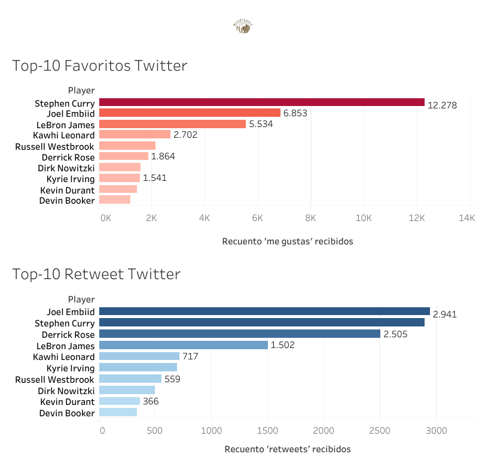
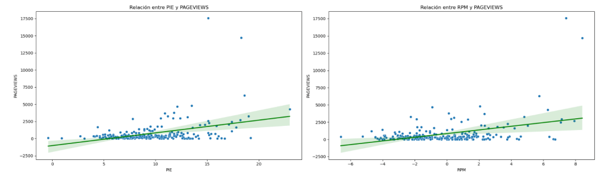
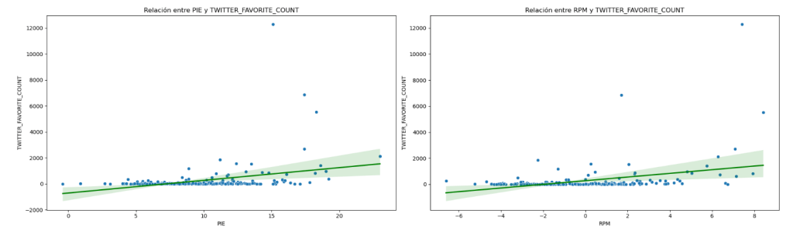
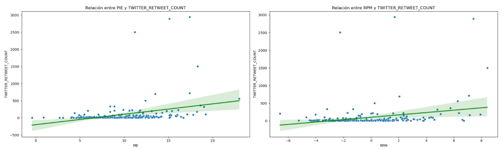
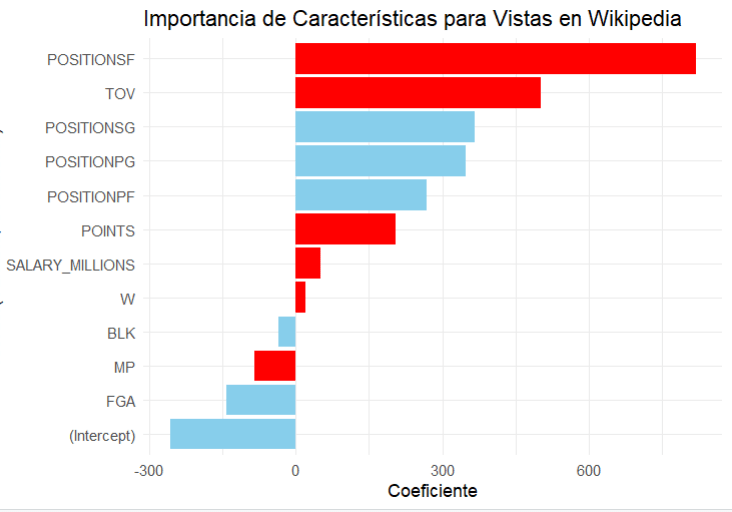
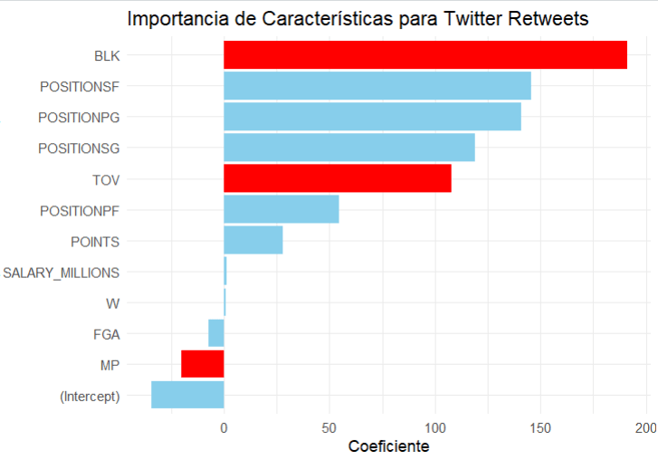
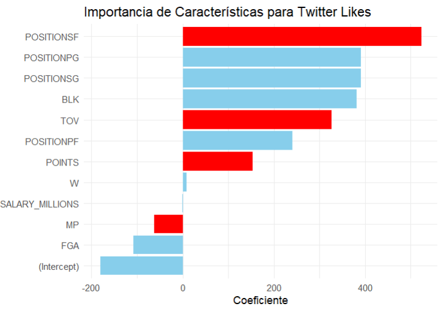
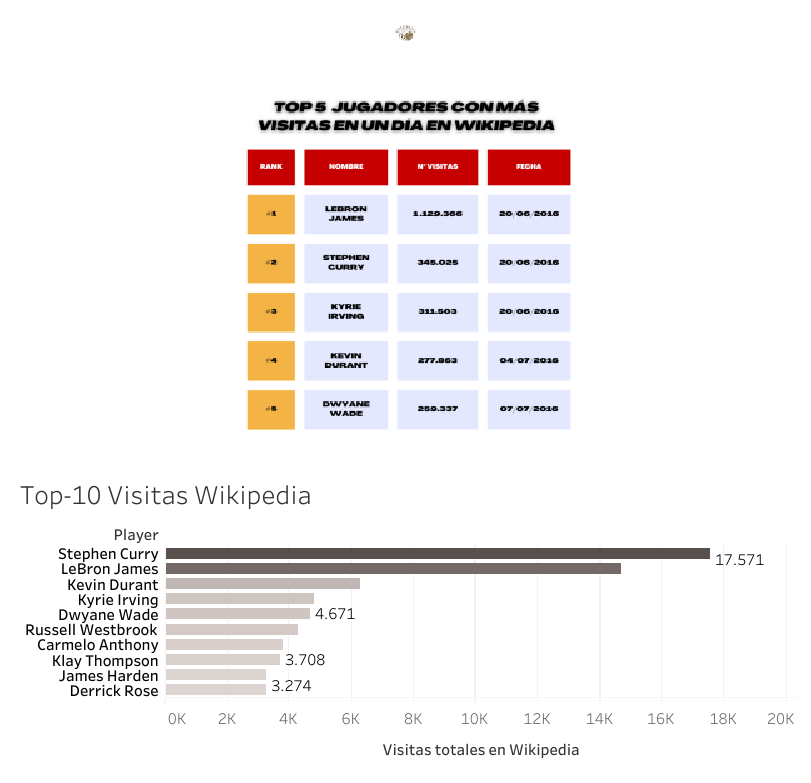

Desde hace ya tiempo, las redes sociales se han convertido en una parte integral de nuestra vida cotidiana, y los jugadores profesionales de baloncesto no son una excepción. Aunque algunos jugadores optan por eliminarlas temporalmente para concentrarse en la competición, la mayoría las utiliza para diversos propósitos: desde anuncios personales y colaboraciones, hasta expresar opiniones sobre política y sociedad. Pero surge una pregunta interesante: ¿Existe una relación directa entre el poder mediático de un jugador y su rendimiento en la cancha? ¿Qué estadísticas podrían correlacionarse con sus interacciones en redes sociales? ¿Son los mejores jugadores necesariamente los más mediáticos? Para responder a estas preguntas, analizaremos datos de la temporada 2016/2017 de 236 jugadores, evaluando en qué medida las interacciones en Twitter y las búsquedas en Wikipedia pueden estar vinculadas con su desempeño en el parqué.

Acerca del conjunto de datos

El conjunto de datos utilizado para este análisis ha sido obtenido de la página web de Kaggle. Puedes acceder a él pinchando&nbsp;<a href="https://www.kaggle.com/datasets/noahgift/social-power-nba/data">aquí</a>.&nbsp;Hay muchos archivos, algunos de ellos repetidos o con métricas adicionales. Por lo tanto, se hizo una selección de los archivos a utilizar y se acabaron usando 2: <em>nba_2017_player_wikipedia.csv</em> y <em>nba_2017_player_with_salary_wiki_twitter.csv</em>

## 1\. Análisis descriptivo del impacto social

Para llevar a cabo un análisis descriptivo del impacto social, se emplearon dos métricas obtenidas de la red social Twitter (ahora conocida como X): el número de 'me gustas' y el número de 'retweets' que un jugador recibió durante la temporada. Además, se analizó el número de visitas al perfil del jugador en Wikipedia. A continuación, se presenta una tabla informativa con el análisis descriptivo de estas métricas.

<table class="has-fixed-layout"><tbody><tr><td></td><td><strong>NÚMERO DE 'ME GUSTAS' RECIBIDOS EN TWITTER</strong></td><td><strong>NÚMERO DE 'RETWEETS' RECIBIDOS EN TWITTER</strong></td><td><strong>NÚMERO DE VISITAS RECIBIDAS EN WIKIPEDIA</strong></td></tr><tr><td>Media</td><td>237,47</td><td>91,82</td><td>761,59</td></tr><tr><td>Desviación estándar</td><td>1025,21</td><td>335,47</td><td>1709,49</td></tr><tr><td>Q1 (25%)</td><td>4</td><td>8</td><td>149,63</td></tr><tr><td>Q2 (50%)</td><td>22,5</td><td>15</td><td>325,75</td></tr><tr><td>Q3 (75%)</td><td>81,63</td><td>47,88</td><td>649,5</td></tr></tbody></table>

Las tres variables muestran distribuciones sesgadas hacia la derecha, con la mayoría de los valores concentrados en el extremo inferior y algunos valores atípicos extremadamente altos. Esto sugiere que, aunque la mayoría de los tweets y visitas a los perfiles de los jugadores generaron una interacción moderada o baja, existen casos excepcionales que captan significativamente más atención y 'engagement'. Este patrón es común en datos de redes sociales y tráfico web. Al comparar las medianas con las medias, se confirma la presencia de valores atípicos significativos que elevan las medias por encima de las medianas.

Estos valores atípicos se ilustran en la siguiente imagen, que muestra el Top 10 de jugadores en las dos métricas de Twitter (las visitas en Wikipedia serán tratadas por separado en otra sección del artículo).

No es sorprendente ver a las grandes estrellas de la liga en los primeros puestos, siendo los más influyentes y con mayor presencia en redes sociales. Los valores son considerablemente altos, y al compararlos con la mediana, se observa una diferencia abismal que destaca cómo estos pocos jugadores registran valores muy superiores, aumentando la media y generando el sesgo mencionado.

En cuanto a los resultados, es importante destacar que la temporada 2016/2017 fue el año de debut de Joel Embiid, quien desde sus inicios tuvo un gran impacto y actividad en redes sociales. A diferencia de otros jugadores ya consolidados en la liga (Curry, LeBron, Nowitzki...), el impacto de Embiid fue inmediato.

## 2\. Relación entre impacto social y rendimiento deportivo.

Ahora que tenemos una visión general de los números, podemos intentar responder la primera pregunta planteada en la introducción: ¿existe alguna relación entre el impacto social y el rendimiento deportivo? Para ello, realizamos una regresión lineal utilizando las métricas mencionadas anteriormente como variables dependientes (número de 'me gustas', 'retweets' y visitas en Wikipedia) y dos métricas de rendimiento como variables independientes: Player Impact Estimate (PIE) y Real Plus-Minus (RPM).

El **PIE** es una métrica que mide la contribución global de un jugador en un partido, incorporando la mayoría de las estadísticas del box score para calcular el porcentaje de eventos del partido en los que el jugador ha tenido un impacto.

El **Real Plus-Minus (RPM)**, por otro lado, es una métrica avanzada desarrollada por ESPN que mide el impacto global de un jugador en el rendimiento de su equipo, tanto en defensa como en ataque. El RPM ajusta la contribución individual de un jugador según la calidad de sus compañeros y oponentes, proporcionando una estimación más precisa de su influencia en el juego.

A continuación, se presentan las imágenes de las regresiones lineales realizadas, así como sus respectivos valores de R², que indican la calidad del modelo en un rango de 0 a 1.

**NÚMERO DE VISITAS RECIBIDAS EN WIKIPEDIA:**

*R2: 0.20*

**NÚMERO DE 'ME GUSTAS' RECIBIDOS EN TWITTER:**

*R2: 0.08*

**NÚMERO DE 'RETWEETS' RECIBIDOS EN TWITTER:**

*R2: 0.10*

Los valores bajos de R² en todos los casos indican que los modelos de regresión lineal no capturan bien las relaciones entre las variables de rendimiento (independientes) y las de impacto en redes sociales (dependientes). Por ejemplo, un R² de 0.2 sugiere que solo el 20% de la variabilidad en las visitas a las páginas de Wikipedia es explicada por el modelo. Al observar los gráficos, es evidente que no parece existir una relación directa, ya que muchos jugadores con altos valores de PIE y RPM tienen pocas interacciones en Twitter. Esto también era previsible, dado que solo una minoría de jugadores registra un número excepcionalmente alto de interacciones, destacándose considerablemente por encima del resto de la liga. Esto sugiere que la relación entre estas variables podría ser no lineal. Sin embargo, dado que nuestro objetivo no es desarrollar un modelo predictivo, nos limitamos a utilizar regresiones lineales.

En respuesta a la primera pregunta, podemos concluir que no existe una relación lineal entre el impacto social y el rendimiento deportivo. Tras evaluar las principales métricas de rendimiento avanzado de los jugadores, es momento de realizar un análisis más exhaustivo para abordar la segunda pregunta: ¿Qué estadísticas tienen relación con las interacciones en redes sociales?

## 3\. Factores que generan impacto social

Para abordar la segunda pregunta y continuar con el análisis de relaciones lineales, seguimos la misma metodología, pero utilizando un conjunto más amplio de métricas como variables independientes: tiros de campo intentados (FGA), victorias (W), minutos jugados (MP), puntos (POINTS), tapones (BLK), posición (POSITION) y salario (SALARY\_MILLIONS).

A diferencia del análisis anterior, aquí se adjunta una imagen que muestra las variables más significativas en la regresión lineal, evaluadas mediante el p-valor. Este valor nos permite diferenciar entre resultados que podrían ser producto del azar y aquellos que son estadísticamente significativos. En la imagen, las métricas con un p-valor < 0.05 se destacan en rojo, indicando su importancia, mientras que la dirección de la barra señala si la relación con la variable dependiente es positiva (hacia la derecha) o negativa (hacia la izquierda).

**NÚMERO DE VISITAS RECIBIDAS EN WIKIPEDIA:**

*R2: 0.31*

**NÚMERO DE 'RETWEETS' RECIBIDOS EN TWITTER:**

*R2: 0.23*

**NÚMERO DE 'ME GUSTAS' RECIBIDOS EN TWITTER:**

*R2: 0.24*

La primera observación es que los valores de R² han aumentado significativamente en los diferentes modelos. Aunque siguen siendo relativamente bajos, esto sugiere que al agregar varias métricas, la capacidad de explicar los factores de impacto social mejora.

En cuanto a las variables más importantes para el modelo, encontramos algunas que son bastante comunes. En particular, las pérdidas y los minutos jugados resultan ser significativos en las tres regresiones: las pérdidas muestran una relación positiva (más pérdidas, mayor interacción) y los minutos jugados una relación negativa (más minutos, menor interacción). Las pérdidas no son una sorpresa, dado que los jugadores más mediáticos, como se observó en el análisis del Top-10, suelen ser grandes estrellas que demandan mucho el balón (por ejemplo, Durant, Westbrook, Derrick Rose), lo que naturalmente lleva a un mayor número de pérdidas en comparación con jugadores de rol que no controlan tanto el balón. Por otro lado, aunque a primera vista puede sorprender que los minutos jugados tengan un impacto negativo, es relevante considerar que jugadores como Karl-Anthony Towns (4º en minutos jugados) o Jimmy Butler (5º) tienen relativamente poca interacción en redes sociales (KAT no registra 'me gustas', y Butler no alcanza el primer cuartil en búsquedas de Wikipedia).

Al revisar otras métricas significativas, encontramos que los puntos y tapones son importantes (lo cual es lógico para jugadores como Kevin Durant o Joel Embiid, respectivamente), así como las victorias y el salario, especialmente en relación con las búsquedas en Wikipedia (estos factores se discutirán con más detalle en la siguiente sección). Finalmente, la posición de alero también se destaca como la más popular en términos de actividad en redes sociales y Wikipedia. Esto no es sorprendente, ya que los aleros han sido históricamente asociados con grandes jugadores versátiles y anotadores. El Top-10 mencionado anteriormente lo confirma con nombres como LeBron James, Kawhi Leonard, y Kevin Durant, que son algunos de los muchos talentosos aleros de la NBA.

En respuesta a la segunda pregunta, aunque los valores de R² todavía indican una relación lineal débil, podemos concluir que existen ciertos factores que influyen en el impacto social, como los puntos, el salario, las victorias y las pérdidas. Todos estos están asociados a un perfil claro de jugador: aquellos con un gran peso en sus equipos y que suelen ser la cara principal de una franquicia.

## 4\. Estudio de caso: top-5 búsquedas en Wikipedia

Una de las métricas clave durante nuestro análisis ha sido el número de búsquedas en Wikipedia. Pero, ¿qué eventos o sucesos generan estas búsquedas? Para responder a esta pregunta, exploramos tanto los jugadores más buscados en Wikipedia durante la temporada como los picos de búsquedas diarias más altos. A continuación, se presenta un top-10 de los jugadores más buscados en Wikipedia y un top-5 de los días con mayor número de búsquedas recibidas por un jugador.

Al analizar el top-5 de búsquedas en un solo día, observamos que los tres primeros jugadores (LeBron James, Stephen Curry y Kyrie Irving) alcanzaron su pico de búsquedas el mismo día: el 20 de junio de 2016. Este día coincidió con el séptimo y definitivo partido de las Finales de la NBA, donde los Cleveland Cavaliers de LeBron y Kyrie se enfrentaron a los Golden State Warriors de Stephen Curry. Los Cavaliers ganaron ese partido, culminando una remontada histórica que quedó registrada en los anales de la mejor liga de baloncesto del mundo.

Los otros dos picos de búsqueda (Kevin Durant y Dwyane Wade) están relacionados con importantes traspasos. En el caso de Durant, el 4 de julio de 2016 se anunció su fichaje por los Golden State Warriors, mientras que Dwyane Wade, tres días después, dejó el equipo donde había pasado la mayor parte de su carrera, Miami Heat, para unirse a la histórica franquicia de los Chicago Bulls.

Uno de los factores que resultó importante en la regresión lineal de las visitas a Wikipedia fue el salario. Observando estos picos de búsqueda, se puede inferir la razón: los grandes movimientos de superestrellas no solo implican contratos millonarios, sino que también generan un considerable tráfico en la web. Además, los partidos de las Finales enfrentaron a dos equipos con un alto número de victorias en su haber (los Warriors hicieron historia con un récord de 73-9 en la temporada regular, mientras que los Cavaliers dominaron su conferencia con un 57-25). Esto también explica la relevancia de las victorias en la regresión lineal.

Nuestro análisis revela que, aunque el impacto social de un jugador en plataformas como Twitter y Wikipedia está influenciado por diversos factores, no existe una relación lineal clara entre estas interacciones y el rendimiento deportivo medido por métricas avanzadas como el PIE y el RPM. Sin embargo, cuando se incorporan otras variables como los puntos, las pérdidas, el salario y las victorias, la capacidad de explicar el impacto social mejora, aunque aún de manera limitada. Esto sugiere que el impacto social de los jugadores está más relacionado con su perfil mediático y eventos clave en sus carreras, como grandes actuaciones en partidos importantes o traspasos significativos, que con su rendimiento en la cancha. En particular, las búsquedas en Wikipedia muestran picos pronunciados en respuesta a momentos destacados de la temporada, como las Finales de la NBA o anuncios de traspasos, subrayando el papel crucial de los medios de comunicación y la narrativa deportiva en la creación del interés público. En última instancia, aunque el rendimiento deportivo es un factor importante, son los momentos excepcionales y los jugadores con gran presencia mediática los que capturan la mayor atención en las redes y la web. Este análisis sugiere que, para comprender el impacto social de un jugador, es esencial considerar tanto su desempeño deportivo como el contexto más amplio de su carrera y su visibilidad mediática.

Si quieres ser un experto obteniendo valor de los datos que nos deja el fantástico mundo del baloncesto, suscríbete aquí debajo para no perderte ninguno de mis análisis. ¿Quieres profundizar en el código detrás de este análisis? Está disponible en GitHub. [Haz click aquí para verlo](https://github.com/Basketmatica/basketmatica-impactosocial). Nos vemos en el siguiente,

Basketmática.
