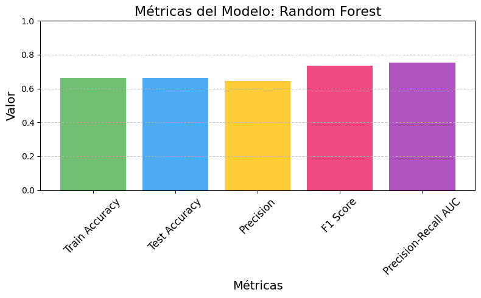
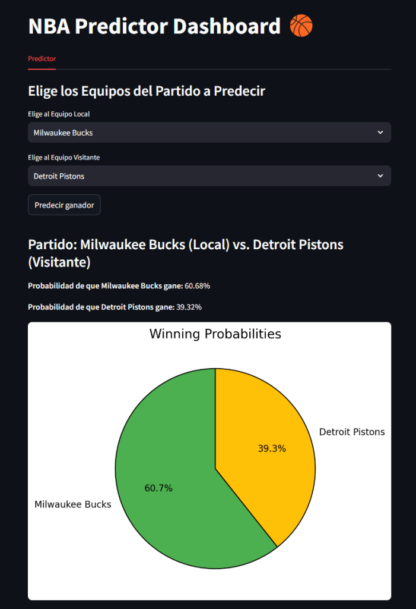
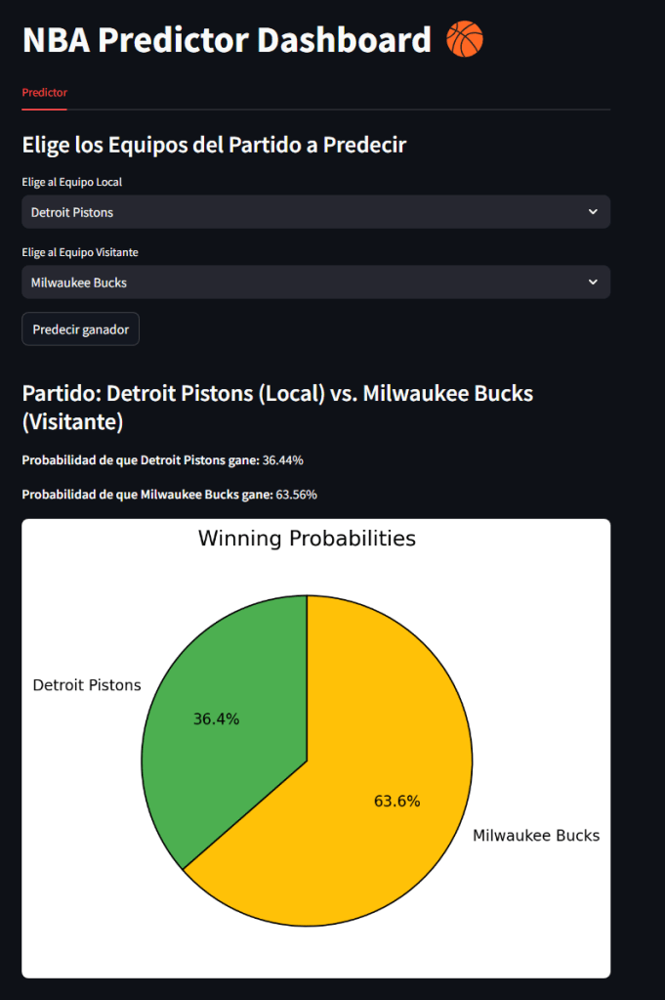

Bienvenidos a "Casos de Uso", una nueva sección en la que exploraré proyectos personales aplicados dentro del Basketball Analytics. En lugar de análisis puramente explicativos, aquí mostraré cómo los datos pueden transformar nuestra forma de entender el baloncesto y abrir nuevas posibilidades.

Para inaugurar esta sección, nos enfrentamos a una pregunta ambiciosa: ¿se puede predecir el ganador de un partido utilizando datos? Sin adelantar demasiado, os diré que cuando combinamos el poder del análisis estadístico con el Machine Learning, la línea entre lo posible y lo imposible comienza a desdibujarse.

Este artículo será más técnico de lo habitual, pero no os preocupéis: evitaré profundizar en los aspectos más complejos de los modelos y el Machine Learning. Para quienes quieran indagar más, dejaré el enlace al repositorio de GitHub con el código completo y estaré encantado de resolver cualquier duda más técnica.

## 1\. El poder de los datos (y su importancia)

En cualquier modelo de Aprendizaje Automático, los datos lo son todo. La calidad y cantidad de la información con la que entrenemos nuestro modelo determinará en gran medida su rendimiento. En mis [hilos de X](https://x.com/basketmatica) he insistido en la importancia de contar con datos precisos y representativos, ya que sin ellos, cualquier modelo—por sofisticado que sea—estará condenado al fracaso.

Para este proyecto, hemos recopilado datos de todos los partidos de temporada regular y Playoffs desde la temporada 2018/2019 hasta la 2023/2024. Esta selección de seis temporadas nos permite lograr un equilibrio entre volumen de datos y estabilidad de tendencias. Incluir demasiados años podría ser problemático, ya que el baloncesto evoluciona: lo que funcionaba en los 90 no necesariamente es válido hoy en día. Un rango de tiempo adecuado evita que el modelo aprenda patrones desactualizados y maximiza su capacidad predictiva.

Cada partido del conjunto de datos incluye información clave, como:

-   Récord actual de cada equipo en la temporada al momento del enfrentamiento.
-   Historial como local y visitante, para identificar diferencias de rendimiento según si se juega en casa o a domicilio.
-   Balance en los últimos 10 partidos, útil para capturar momentos en los que un equipo está pasando una buena o mala racha.

Por supuesto, también contamos con el resultado final de cada partido, pero aquí entra en juego un concepto crucial: *data leakage*. Si el modelo tuviera acceso a esta información al hacer una predicción, simplemente replicaría los resultados conocidos, lo que lo haría inútil en un caso real. Por eso, es fundamental excluir cualquier dato que no estaría disponible al momento de la predicción.

En otros artículos suelo proporcionar un enlace a la fuente de datos, pero en este caso, la información fue obtenida a través de una API (RapidAPI). Sin entrar en demasiados tecnicismos, esta API nos permitió acceder a los datos de partidos en tiempo real y a estadísticas históricas de la NBA. Mediante peticiones automatizadas, extrajimos y estructuramos la información necesaria para alimentar nuestro modelo. Este enfoque no solo garantiza datos actualizados y precisos, sino que también nos ahorra el trabajo manual de recopilación, permitiéndonos centrarnos en el análisis y en la construcción del modelo predictivo. No obstante, el conjunto de datos obtenidos de la API lo podréis encontrar en el repositorio de GitHub del proyecto (enlace al final del artículo).

## 2\. La selección del modelo

Existen muchos modelos de Aprendizaje Automático, que se pueden dividir en dos grandes grupos: aprendizaje supervisado (cuando el modelo se entrena conociendo la respuesta correcta) y aprendizaje no supervisado (cuando el modelo busca patrones sin conocer la respuesta). Nuestro objetivo es que el modelo prediga el ganador de un partido. Para ello, lo entrenaremos utilizando datos históricos en los que ya conocemos el resultado (usando solo una parte de nuestro conjunto de datos en la que le diremos el ganador del partido), de modo que pueda aprender patrones. Luego, evaluaremos su rendimiento pidiéndole que prediga los ganadores de partidos que no ha visto antes (la otra parte de nuestro conjunto de datos, sin decirle quién ganó el partido), comparando sus respuestas con los resultados reales.

Para esta tarea, probamos tres modelos distintos: Random Forest, XGBoost y Gradient Boosting. Sin entrar en los detalles técnicos de cada modelo, a continuación se muestra una tabla con las métricas de evaluación obtenidas para cada uno:

<table class="has-fixed-layout"><tbody><tr><td></td><td><strong>Train Accuracy</strong></td><td><strong>Test Accuracy</strong></td><td><strong>Precision</strong></td><td><strong>F1 Score</strong></td><td><strong>Precision-Recall AUC</strong></td></tr><tr><td><strong>Random Forest</strong></td><td>0,662</td><td>0,662</td><td>0,644</td><td>0,735</td><td>0,753</td></tr><tr><td><strong>XGBoost</strong></td><td>0,655</td><td>0,659</td><td>0,639</td><td>0,737</td><td>0,744</td></tr><tr><td><strong>Gradient Boosting</strong></td><td>0,56</td><td>0,547</td><td>0,547</td><td>0,701</td><td>0,732</td></tr></tbody></table>

Sin necesidad de ser expertos en Machine Learning ni en cada una de estas métricas, podemos notar que Random Forest obtiene los mejores resultados en casi todos los apartados, seguido muy de cerca por XGBoost. Por esta razón, optaremos por usar Random Forest para ponerlo a prueba en nuestras predicciones.

*Gráfica con las métricas para el mejor modelo (Random Forest).*

## 3\. Predicción de resultados

Para evaluar el modelo, he desarrollado una interfaz gráfica interactiva (Dashboard) que permite seleccionar los equipos local y visitante. Al pulsar el botón "Predecir ganador", se genera un gráfico circular mostrando las probabilidades de victoria de cada equipo según el modelo.

A continuación, se muestra un ejemplo del Dashboard prediciendo el ganador entre Milwaukee Bucks (local) y los Detroit Pistons (visitante):

Y a continuación, el mismo enfrentamiento, pero con los equipos invertidos: los Pistons jugando como locales y los Bucks como visitantes:

Como se puede observar, el modelo tiene en cuenta el factor cancha, aunque en este caso concreto resulta llamativo que la probabilidad de victoria de los Pistons disminuya al jugar como locales. Sin embargo, este comportamiento tiene sentido, ya que hemos elegido un enfrentamiento entre dos equipos con un rendimiento muy desigual en las últimas seis temporadas. Seguramente, si seleccionamos dos equipos de nivel más parejo, el factor local influirá de manera más evidente en la predicción.

Para los que queráis probar el modelo por vuestra cuenta, en el repositorio de GitHub encontraréis el código completo, junto con las instrucciones necesarias para ejecutarlo y realizar vuestras propias pruebas.

## 4\. Puntos de mejora

Este proyecto lo realicé con mayor énfasis en la parte de la obtención de datos a través de una API y en la visualización de resultados. Si bien el modelo es sólido, siempre es interesante hacer autocrítica y analizar posibles mejoras:

1.  **Calidad y profundidad de los datos**. Actualmente, el modelo se basa en el récord de victorias y derrotas, lo cual aporta información valiosa, pero es insuficiente sin un contexto más amplio. Incluir métricas como Offensive Rating, Defensive Rating, media de puntos, rebotes, asistencias, y otras estadísticas avanzadas permitiría capturar mejor el estado de forma de cada equipo y mejorar la precisión de las predicciones.
2.  **Optimización del modelo**. El entrenamiento se llevó a cabo sin aplicar algunas buenas prácticas de Machine Learning, como la optimización de hiperparámetros o la normalización de variables. Implementar estos ajustes podría mejorar notablemente el rendimiento y estabilidad del modelo en futuras versiones.

Estas mejoras quedan abiertas para una posible segunda versión del proyecto, con un modelo más refinado y datos más completos. Si tienes alguna sugerencia o identificas algún otro punto de mejora, estaré encantado de considerarlo. ¡Tu feedback es más que bienvenido!

Si algo me ha enseñado este proyecto es que, aunque los datos pueden ayudarnos a entender mejor el juego y reducir la incertidumbre, el baloncesto sigue siendo un deporte lleno de imprevistos. No hay modelo que pueda capturar por completo la magia de un partido, los momentos clave o el impacto de una actuación extraordinaria. Sin embargo, lo interesante no es solo predecir, sino entender qué factores influyen en la victoria y cómo podemos utilizarlos para obtener una ventaja competitiva.

Si quieres ser un experto obteniendo valor de los datos que nos deja el fantástico mundo del baloncesto, suscríbete aquí debajo para no perderte ninguno de mis análisis. ¿Quieres profundizar en el código detrás de este análisis? Está disponible en GitHub. [Haz click aquí para verlo](https://github.com/Basketmatica/basketmatica-modelopredictivo). Nos vemos en el siguiente,

Basketmática.
