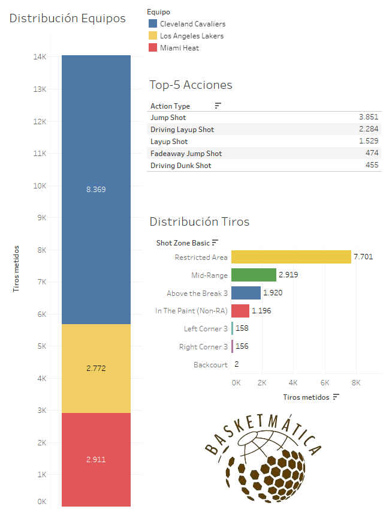
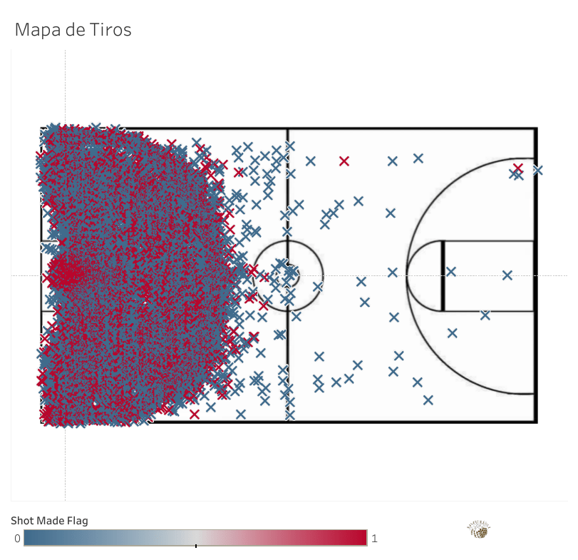

38 389 puntos en temporada regular. Y sumando. El 8 de febrero de 2023, LeBron James se convirtió en el máximo anotador de la historia de la NBA, superando al legendario Kareem Abdul-Jabbar y coronándose como el rey anotador de este deporte. Pero, ¿cómo fue el camino hacia el trono? ¿Dónde está el secreto detrás de una cifra tan abrumadora, que ya supera los 40 000 puntos y no para de crecer? A continuación, analizamos **el camino del Rey**.

Nota previa.

Todo el análisis se realiza en base a <strong>tiros de campo</strong>, en ningún momento se toman en cuenta los tiros libres. Puedes acceder a la fuente de datos utilizada para este análisis pulsando <a href="https://www.kaggle.com/datasets/eduvadillo/lebron-james-career-shots?select=lebron_shot_data.csv">aquí</a>.

## 1\. Métricas clave

Porcentajes:

-   %TC: 50.5%
-   %T2: 55.38%
-   %T3: 34.46%
-   %eFG: 54.52%

Ratios:

-   2PR: 76.67%
-   3PR: 23.33%
-   PPA: 1.09

LeBron se abre camino hacia el trono como mejor sabe: dominando la zona. Más del 75% de sus tiros de campo en toda su carrera vienen de dentro de la línea de tres, con más de un 55% de efectividad. Por debajo de la media de la liga en porcentaje desde más allá de la línea (desde su llegada a la NBA, la media de %T3 oscila en torno al [35-36%](https://www.basketball-reference.com/leagues/NBA_stats_per_game.html)), pero su paso destructivo por la zona y la media distancia le permiten estar por encima de la media de eFG% en una era donde el triple ha sacudido completamente esta estadística (subida de más del 5% en menos de 10 temporadas).

Leyenda de métricas.
<ul class="wp-block-list"><li>%TC: Porcentaje de acierto de tiros de campo. Divide los tiros totales anotados entre los tiros totales intentados.</li><li>%T2: Porcentaje de aciertos de tiros de 2 puntos. Divide los tiros de 2 anotados entre los tiros de 2 intentados.</li><li>%T3: Porcentaje de acierto de tiros de 3 puntos. Divide los tiros de 3 anotados entre los tiros de 3 intentados.</li><li>%eFG: Porcentaje efectivo de acierto de tiros de campo. Tiene en cuenta que un triple vale más que una canasta de dos, y se calcula igual que el %TC pero multiplicando los tiros de 3 anotados por 1.5.</li><li>2PR: Ratio de tiros de 2 puntos. Ratio entre tiros intentados de 2 puntos frente a los tiros intentados totales.</li><li>3PR: Ratio de tiros de 3 puntos. Ratio entre tiros intentados de 3 puntos frente a los tiros intentados totales.</li><li>PPA: Puntos Por Intento. Media de puntos por cada tiro de campo.</li></ul>

## 2\. Distribuciones

Hasta en tres equipos ha impuesto su mandato nuestro Rey, destacando Cleveland Cavaliers, donde ha pasado 11 de sus 20 temporadas. Naturalmente, ha metido muchos más tiros de campo ya que es donde más tiempo ha pasado. Pero también ha coincidido con su *prime* anotador, ya que en Cleveland tiene su mayor ratio canastas/temporada, superando su ratio en Miami Heat y, por debajo, Los Ángeles Lakers (sin considerar posibles periodos lesivos con alguno de los tres equipos ni el periodo de pandemia mientras militaba en el equipo angelino).

Su Top 5 de acciones nos dan una pista sobre cómo se alzó hasta la cima: un letal tiro de media distancia, tanto en pull-up como en fadeaway, y una fuerza bruta imparable cerca de la canasta, con sus espectaculares mates y sus contraataques a velocidades vertiginosas que incluso los defensores más valientes se lo pensaban dos veces antes de saltar al tapón.

La distribución de tiros también acompaña este razonamiento: el área restringida es su *spot* favorito, fruto de casi el 55% de sus tiros de campo totales, seguido, bastante de lejos, de la media distancia y los triples frontales y desde 45. A continuación se detallan los porcentajes de acierto desde cada una de las zonas:

-   Zona Restringida (RA): 71.98%
-   Media Distancia: 38.16%
-   Triples Frontales + 45: 34.13%
-   Zona (no RA): 40.04%
-   Triples Esquina Izquierda: 39.70%
-   Triples Esquina Derecha: 36.03%
-   Medio Campo: 6.06%

A simple vista, llama la atención el asombroso acierto desde las esquinas (más concretamente desde la izquierda, rozando el 40%). Aunque al ser una zona poco frecuentada por El Rey, es posible que la regresión a la media hiciese efecto a la que aumentase el número de intentos desde ahí. ¿O tal vez nos perdimos un potencial tirador de esquina de élite? Sea o no así, hemos disfrutado de uno de los jugadores más dominantes que ha pisado un parqué, brindando espectáculo y causando estragos en la RA (~Restricted~ Royal Area).

## 3\. Mapa de Tiro

Para concluir el análisis, aquí se puede apreciar el mapa de los 27825 tiros de campo que LeBron James necesitó para romper el récord de anotación de la NBA. Con esta visualización solo quiero aportar una única cosa: para coronarse como el mejor, hay que fallar 13773 veces. No lo digo yo. Lo dicen los datos.

Si quieres ser un experto obteniendo valor de los datos que nos deja el fantástico mundo del baloncesto, suscríbete aquí debajo para no perderte ninguno de mis análisis. ¿Quieres profundizar en el código detrás de este análisis? Está disponible en GitHub. [Haz click aquí para verlo](https://github.com/Basketmatica/basketmatica-lebron). Nos vemos en el siguiente,

Basketmática.
