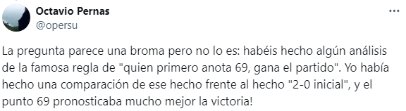
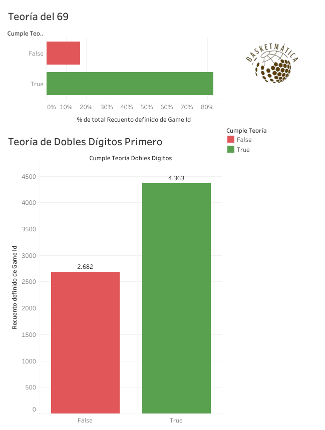

En uno de mis últimos hilos publicados en mi [cuenta de X](https://x.com/basketmatica), recibí un comentario que despertó mi curiosidad. Octavio escribió lo siguiente:

Mientras todavía procesaba la sorpresa de este dato, Guillermo añadió otra observación interesante:

Ambas aportaciones me parecieron fascinantes, y decidí realizar un análisis más profundo para responder a algunas preguntas clave:

¿Existe una relación directa entre anotar primero el punto número 69 y ganar el partido? ¿Y entre anotar primero el punto número 10 y la victoria? ¿Qué peso tiene empezar por delante en el marcador? ¿Marca la diferencia tener más jugadores por encima de los dobles dígitos que el rival?

Para responder a estas preguntas, utilicé datos de la Euroliga y la Eurocup, desde la temporada 2007/2008 hasta la presente (2024/2025). Este conjunto de datos representa una muestra amplia y confiable, ideal para extraer conclusiones robustas (Si aún no sabes qué es una muestra representativa ni cuántos datos se necesitan para un análisis fiable, puedes consultar [este hilo](https://x.com/basketmatica/status/1858125119010312523)).

Acerca del conjunto de datos

El conjunto de datos utilizado para este análisis ha sido obtenido de la página web de Kaggle. Puedes acceder a él pinchando <a href="https://www.kaggle.com/datasets/babissamothrakis/euroleague-datasets">aquí</a>. Es una colección de conjuntos de datos de Euroliga y Eurocup desde la temporada 2007/2008, y se actualiza regularmente.

## 1\. Introducción a las teorías a analizar.

Antes de adentrarnos en los datos, es importante contextualizar las teorías que se analizarán:

-   **Teoría del 69:** Sostiene que el equipo que alcanza primero los 69 puntos tiene mayores probabilidades de ganar el partido.
-   **Teoría de los Dobles Dígitos:** Similar a la anterior, pero enfocada en el equipo que llega primero a 10 puntos.
-   **Teoría del 2-0 Inicial:** Plantea que anotar primero (un 2-0) puede proporcionar una ligera ventaja psicológica que se traduzca en una victoria.
-   **Teoría de Jugadores que Alcanzan 10+ Puntos:** Explora si contar con más jugadores que superen los 10 puntos individuales aumenta las probabilidades de ganar.

Para ilustrar el impacto de la **Teoría del 69**, aquí os comparto un artículo de Rafael en el que analiza diversos partidos donde esta teoría se cumple: [La Teoría del 69](https://www.laopiniondemalaga.es/deportes/2008/12/01/teoria-69-29061046.html)

## 2\. Teoría del 69

A continuación, se muestra una tabla con los resultados obtenidos del análisis:

<table class="has-fixed-layout"><tbody><tr><td><strong>Competición</strong></td><td><strong>Porcentaje éxito Teoría del 69</strong></td></tr><tr><td>Euroliga</td><td>82,84%</td></tr><tr><td>Eurocup</td><td>83,84%</td></tr><tr><td><strong>TOTAL</strong></td><td><strong>83,29%</strong></td></tr></tbody></table>

En el 83,29% de los partidos, el equipo que llega primero a 69 puntos termina ganando- En el 16,71% de los casos donde no se cumple la teoría, se incluyen partidos en los que ningún equipo llegó a esa cifra.

Este dato es contundente, aunque razonable: los 69 puntos suelen alcanzarse en la recta final del partido, una fase donde cada posesión cuenta y las remontadas son más difíciles. Es posible que los casos donde no se cumple la teoría correspondan a partidos muy ajustados en el marcador (por ejemplo, 69-68).

## 3\. Teoría de Dobles Dígitos

¿Tiene una relación similar con la victoria el equipo que llega primero a 10 puntos? Los datos arrojan un resultado interesante:

<table class="has-fixed-layout"><tbody><tr><td><strong>Competición</strong></td><td><strong>Porcentaje éxito Teoría de Dobles Dígitos</strong></td></tr><tr><td>Euroliga</td><td>61,73%</td></tr><tr><td>Eurocup</td><td>62,18%</td></tr><tr><td><strong>TOTAL</strong></td><td><strong>61,94%</strong></td></tr></tbody></table>

Aunque su correlación es menor que la de la Teoría del 69, el 61,94% de los equipos que alcanzan primero los 10 puntos terminan ganando. Esto tiene sentido, ya que los 10 puntos se alcanzan en los primeros compases del partido, donde el equipo rival tiene más tiempo para remontar. Sin embargo, también refleja que un buen inicio puede marcar el ritmo y generar una ventaja psicológica.

## 4\. Teoría del 2-0 Inicial

¿Anotar primero proporciona alguna ventaja significativa? Veamos los resultados:

<table class="has-fixed-layout"><tbody><tr><td><strong>Competición</strong></td><td><strong>Porcentaje éxito Teoría del 2-0 Inicial</strong></td></tr><tr><td>Euroliga</td><td>39,88%</td></tr><tr><td>Eurocup</td><td>40,41%</td></tr><tr><td><strong>TOTAL</strong></td><td><strong>40,12%</strong></td></tr></tbody></table>

Solo en el 40,12% de los partidos, el equipo que anotó primero (2-0) terminó ganando. Esta teoría tiene una correlación muy baja con la victoria, ya que la primera canasta no define el resto del encuentro. A diferencia de los Dobles Dígitos, un simple 2-0 no genera suficiente impacto psicológico ni estratégico en el rival.

## 5\. Teoría de Jugadores que Alcanzan 10+ Puntos

Este análisis examina si tener más jugadores que superen los 10 puntos individuales es un factor decisivo. Los resultados pueden sorprender:

<table class="has-fixed-layout"><tbody><tr><td><strong>Competición</strong></td><td><strong>Porcentaje éxito Teoría de Jugadores que Alcanzan 10+ Puntos</strong></td></tr><tr><td>Euroliga</td><td>55,82%</td></tr><tr><td>Eurocup</td><td>55,46%</td></tr><tr><td><strong>TOTAL</strong></td><td><strong>55,65%</strong></td></tr></tbody></table>

Solo en el 55,65% de los casos, el equipo con más jugadores de 10+ puntos ganó el partido. Aunque pueda parecer que tener más anotadores consistentes debería garantizar la victoria, hay varios matices que influyen en este porcentaje relativamente bajo:

1.  **No diferencia entre un jugador que anota 10 puntos y otro que anota 20 puntos**, aunque su impacto real en el marcador es muy diferente.
2.  **Diferencia pequeños márgenes:** Dos jugadores con 9 puntos quedarían por debajo del umbral, mientras que dos con 10 puntos cuentan como superiores, pese a que la diferencia en el +/- es mínima.

Este resultado muestra que el análisis de estadísticas individuales requiere un enfoque más amplio para capturar su impacto real en el juego.

## 6\. Reflexión final

Al ordenar las teorías según su porcentaje de cumplimiento, obtenemos la siguiente clasificación:

1.  **Teoría del 69: 83.29%**
2.  Teoría de los Dobles Dígitos Primero: 61.94%
3.  Teoría de Jugadores con 10+ Puntos: 55.65%
4.  Teoría del 2-0 Inicial: 40.12%

Analizadas todas las teorías, observamos algunos patrones interesantes:

-   Excepto en la Teoría de Jugadores con 10+ Puntos, el porcentaje de éxito es ligeramente superior en la Eurocup que en la Euroliga, lo que puede deberse a diferencias en el nivel de competitividad o estilo de juego.
-   La Teoría del 69 es la más sólida y la que menos limitaciones presenta.
-   El resto de las teorías, aunque interesantes, están más influenciadas por factores contextuales y no explican todo el desarrollo del partido.

Si bien estas teorías son curiosas, no deben interpretarse como una guía para planificar estrategias. Hay que tener en cuenta dos puntos clave:

1.  **El contexto importa:** Lo que se cumple a nivel europeo puede no aplicarse en competiciones nacionales, ni viceversa.
2.  Quizás mi frase favorita cuando hablo de estadística: **correlación no implica causalidad**. Aunque un 60% de los equipos que anotan primero 10 puntos ganan el partido, esto no significa que alcanzar esa cifra sea la causa directa de la victoria.

El baloncesto es un deporte complejo, donde múltiples factores interactúan para definir un resultado. Sin embargo, analizar estos patrones nos permite explorar nuevas perspectivas y apreciar mejor las dinámicas del juego.

Si quieres ser un experto obteniendo valor de los datos que nos deja el fantástico mundo del baloncesto, suscríbete aquí debajo para no perderte ninguno de mis análisis. ¿Quieres profundizar en el código detrás de este análisis? Está disponible en GitHub. [Haz click aquí para verlo](https://github.com/Basketmatica/basketmatica-teoria69). Nos vemos en el siguiente,

Basketmática.
