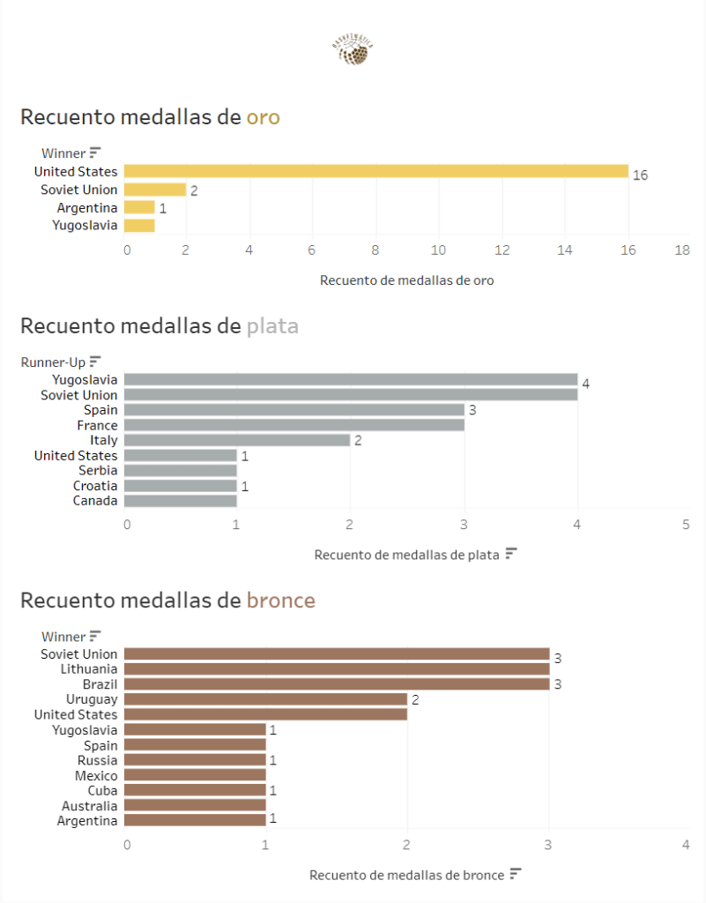
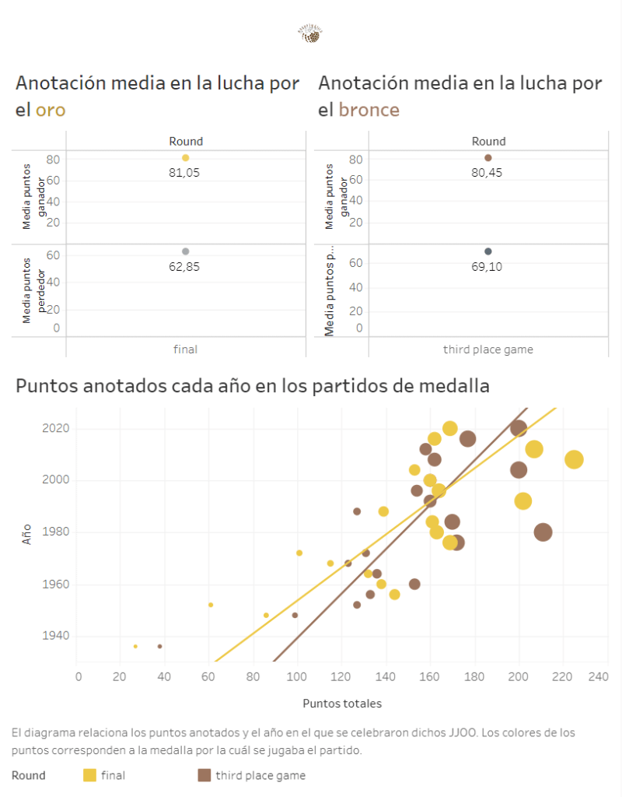
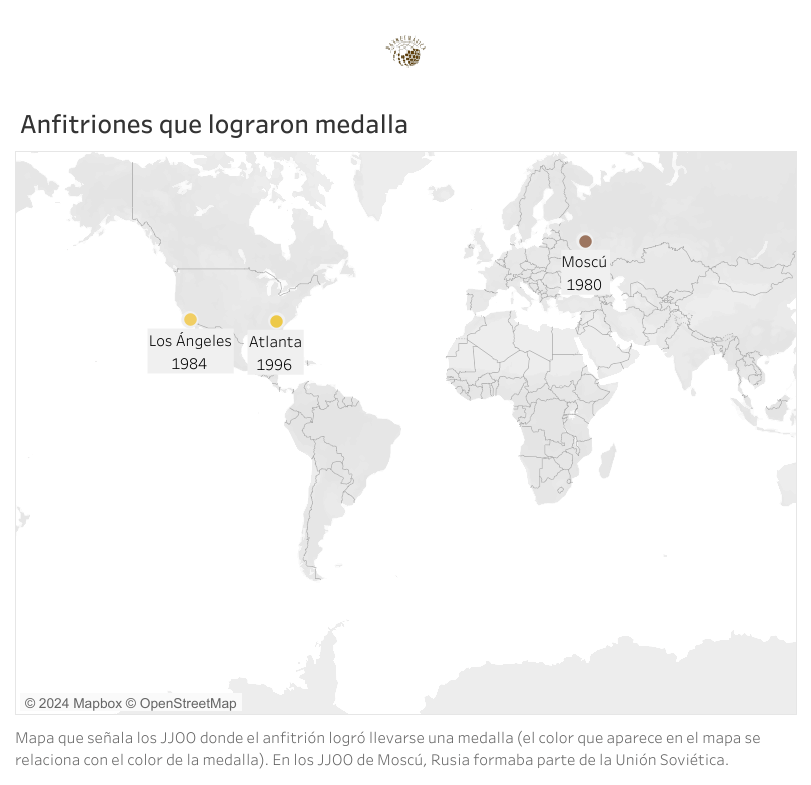

A 10 días del inicio oficial de los Juegos Olímpicos de París 2024, ya se conocen los grupos que disputarán la primera fase en la lucha por el ansiado oro. Además, el Preolímpico y los partidos amistosos nos han permitido captar sensaciones de cada país clasificado. Pero, ¿qué nos dice la historia? ¿Y los datos? En este artículo, desentrañaremos algunas estadísticas y curiosidades que nos prepararán para disfrutar de una de las citas más importantes del baloncesto internacional.

Acerca del conjunto de datos

El conjunto de datos utilizado para este análisis ha sido obtenido de la página web de Kaggle. Puedes acceder a él pinchando <a href="https://www.kaggle.com/datasets/isaienkov/basketball-at-summer-olympic-games">aquí</a>. Como se puede observar, es un conjunto de datos muy sencillo y de no demasiada profundidad, centrado puramente en equipos y sin tener en cuenta datos individuales de los jugadores.

## **1\. Recuento de medallas**

En los siguientes gráficos de barras se puede observar una comparativa de las medallas de cada color obtenidas por las distintas selecciones:

Para sorpresa de nadie, Estados Unidos demuestra su gran dominancia con 16 de las 19 medallas de oro posibles. Además, es la única selección que ha ganado medalla en todas sus participaciones (excepto en Moscú 1980, donde no participó como protesta contra la invasión de la Unión Soviética a Afganistán).

La antigua y poderosa Unión Soviética, aunque lejos de la supremacía de EE.UU., se corona como la segunda mayor fuerza con 9 medallas, todas obtenidas antes de su disolución. Le sigue de cerca Yugoslavia, otra potencia que se disolvió en la década de los 90.

A partir de ahí, se observa una mayor igualdad entre las selecciones, destacando España con sus 3 medallas de plata (dos de ellas de manera consecutiva, Beijing 2008 y Londres 2012) y Argentina con su valioso oro en Atenas 2004, donde derrotó a Italia por 84-69.

## **2\. Un vistazo a los partidos en los que las medallas estaban en juego**

A continuación, se muestra un dashboard informativo con datos sobre los partidos en los que las medallas estaban en juego (tanto la final como el tercer y cuarto puesto):

En el primer gráfico, se aprecia una comparativa de la media de puntos anotados por cada equipo en los partidos por el oro y el bronce respectivamente. Aunque los ganadores de los encuentros (oro y bronce) anotan una cantidad similar de puntos, la final tiende a ser menos igualada que la lucha por el bronce. La principal causa de esta disparidad en la final tiene un nombre: Estados Unidos. Con una selección llena de superestrellas presente en prácticamente todas las finales disputadas, no es de extrañar que la media de diferencia de puntos se dispare. Desde los primeros Juegos Olímpicos celebrados en Berlín en 1936, la selección de América del Norte ha demostrado su superioridad y dominio en el juego y en el apartado físico.

Por otra parte, el segundo gráfico muestra la evolución de los puntos totales anotados en los partidos por las medallas. Las líneas de tendencia indican una clara evolución ascendente, especialmente en la década de los 80. Este incremento se debe muy posiblemente a la evolución en el tiro de tres puntos, ya que los equipos empezaron a valorar más este arte y a enfatizar su explotación.

Como curiosidad, el partido menos anotador en la historia de las finales de los JJOO fue un encuentro entre EE.UU. y Canadá en Berlín 1936, que terminó con un marcador de 19-8. Este resultado, además de celebrarse en una cancha exterior, refleja el poco trayecto que llevaba el baloncesto en ese entonces, con menos de 50 años de existencia y en plena expansión. En cambio, el partido más anotador de la historia de las finales fue el duelo entre EE.UU. y España en Beijing 2008. Fue un enfrentamiento entre titanes con grandes jugadores en ambos lados de la cancha (LeBron James, Kobe Bryant, Pau Gasol, Rudy Fernández...), con un intercambio constante de puntos que la selección americana sentenció con un 118-107. Si os interesa, [en este enlace](https://www.youtube.com/watch?v=-eHxLqT21r8) tenéis un resumen muy extendido del partido; merece la pena revivirlo y disfrutar de uno de los encuentros que pasó a la historia.

## **3\. Anfitriones con medalla**

Antes de continuar, déjame comprobar si eres un verdadero friki del baloncesto: ¿sabrías decirme qué selecciones han logrado una medalla en los Juegos Olímpicos celebrados en su propio país?

Tanto si conoces la respuesta como si no, aquí te dejo un mapa que muestra la localización y el año de los Juegos Olímpicos en los que el anfitrión logró alzarse con una medalla.

Las únicas selecciones que han logrado medalla en su país son Estados Unidos (oro en dos ocasiones) y la Unión Soviética. La Unión Soviética ganó el bronce en los JJOO de Moscú 1980, en los que Estados Unidos no participó como protesta. El tercer y cuarto puesto se saldó con una victoria de la URSS sobre España por 117-94, mientras que el oro lo logró Yugoslavia (su primera y única medalla de oro), imponiéndose a Italia por 86-77.

En los JJOO de Los Ángeles 1984, Estados Unidos aprovechó la ausencia de la Unión Soviética (que boicoteó en respuesta al boicot de 1980) y se impuso a España por un contundente 96-65. Doce años más tarde, después del famoso Dream Team de Barcelona 1992, Estados Unidos volvió a coronarse campeona en su país en Atlanta 1996, al vencer a Yugoslavia por 95-69.

Aunque las estadísticas predicen la medalla de oro para Estados Unidos incluso antes de comenzar estos JJOO, este nuevo "Dream Team" deberá trabajar muy duro. Además de adaptarse al reglamento FIBA, tendrán que enfrentarse a grandes rivales que nunca lo ponen fácil, como España, Francia y la nueva sensación bajo la tutela del español Jordi Fernández: Canadá.

Si quieres ser un experto obteniendo valor de los datos que nos deja el fantástico mundo del baloncesto, suscríbete aquí debajo para no perderte ninguno de mis análisis. ¿Quieres profundizar en el código detrás de este análisis? Está disponible en GitHub. [Haz click aquí para verlo](https://github.com/Basketmatica/basketmatica-jjoo). Nos vemos en el siguiente,

Basketmática.
