Esta noche se ha celebrado el Draft de la NBA, un evento en el que los equipos de la mejor liga de baloncesto del mundo pueden escoger a los jugadores universitarios y europeos más prometedores para incorporarlos a sus plantillas, con la esperanza de dar un salto de calidad que les acerque al preciado título de campeón. La NCAA, la competición universitaria más prestigiosa del planeta, alberga múltiples equipos de los que han salido verdaderas estrellas del baloncesto, como la Universidad de North Carolina, lugar donde se formó el mejor jugador de todos los tiempos: Michael Jordan. Pero, ¿cuál es la universidad de la que salen los mejores jugadores? Es una pregunta compleja, pero en este análisis, con la ayuda del poder de los datos, intentaremos aproximarnos a una respuesta. Además, lo haremos en un formato de competición, al más puro estilo NCAA.

Acerca del conjunto de datos

El conjunto de datos utilizado para este análisis ha sido obtenido de la página web de Kaggle. Puedes acceder a él pinchando <a href="https://www.kaggle.com/datasets/bryanchungweather/draft-picks-from-each-university">aquí</a>. El conjunto de datos original incluía también la universidad de Arizona, pero tras detectar datos incorrectos (los jugadores en realidad pertenecían a la universidad de Washington, es decir, había dos archivos duplicados) se excluyó dicha universidad del análisis.

## **Formato de competición**

Nueve universidades participarán en una competición en formato de rondas. Cada ronda explorará una estadística específica y se compararán todas las universidades en esa métrica. La universidad que obtenga el mejor rendimiento en dicha estadística recibirá la puntuación máxima (9 puntos), y los puntos se distribuirán de manera decreciente según el rendimiento de cada universidad. Una vez repartidos los puntos, se actualizará la clasificación según la puntuación obtenida por cada universidad. Al final de las seis rondas de competición, la universidad con más puntos será coronada como la **fábrica de talento**. A continuación, presentamos la parrilla de salida con los equipos que participan en esta emocionante competición.

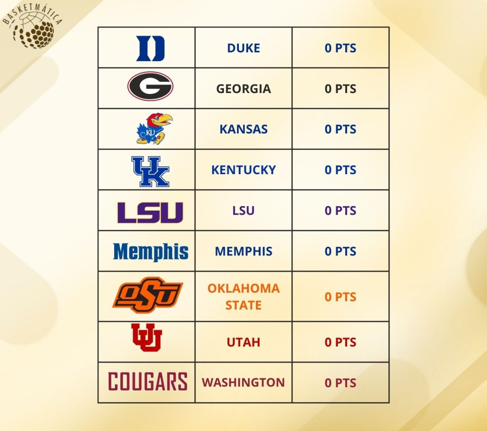

*Clasificación inicial*

## **Ronda 1: Jugadores drafteados en 1a ronda**

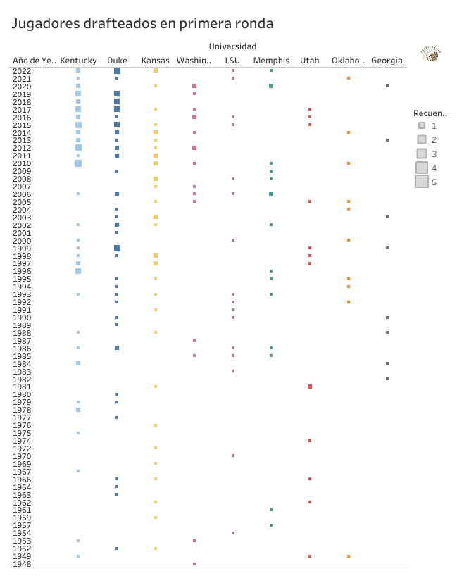

En la imagen podemos observar un mapa de calor que muestra el número de jugadores provenientes de cada universidad que han sido elegidos en la primera ronda del Draft de la NBA a lo largo de los años. Ser elegido en la primera ronda del draft es sinónimo de estar entre los 30 jugadores más prometedores de tu generación, un factor crucial a la hora de determinar qué programas universitarios consiguen un mayor número de jugadores talentosos. Aunque puede observarse en la imagen previa, estos son los números exactos de jugadores drafteados en primera ronda para cada universidad:

-   Kentucky: 55
-   Duke: 53
-   Kansas: 36
-   Washington: 17
-   LSU: 16
-   Memphis: 16
-   Utah: 13
-   Oklahoma State: 10
-   Georgia: 8

Se puede apreciar una gran brecha entre el tercero (Kansas) y el cuarto (Washington), ya que Kansas ha tenido más del doble de jugadores drafteados en primera ronda. Sin embargo, sin duda parece que los dos colosos van a ser Kentucky y Duke, las cuales figuran entre las universidades más famosas y prestigiosas dentro del mundo del baloncesto. Tras la primera ronda, así queda nuestra clasificación:

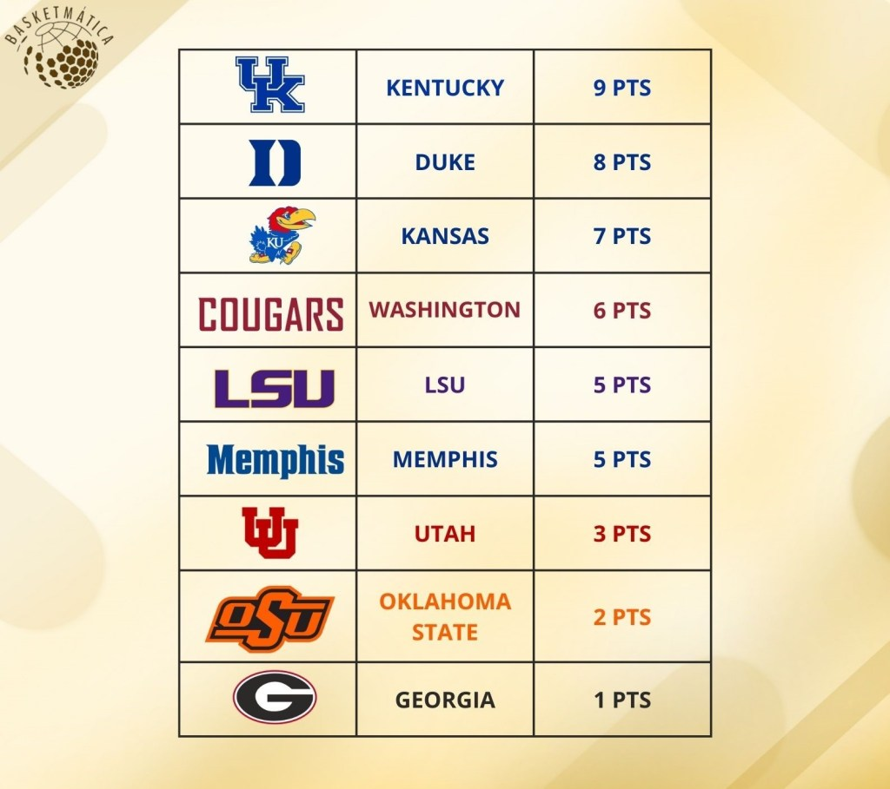

*Clasificación tras la primera ronda*

## **Ronda 2: Minutos totales disputados de los jugadores drafteados**

Las distintas ediciones del Draft de la NBA siempre traen consigo luces y sombras. Por un lado, se eligen jugadores que terminan teniendo carreras memorables en la NBA; por otro, también se seleccionan grandes talentos que no logran adaptarse al ritmo frenético de una liga tan competitiva. Estos jugadores a menudo no consiguen regularidad en ningún equipo o son afectados por la peor de las maldiciones del deporte: las lesiones. En el siguiente gráfico de líneas, se puede observar la acumulación de minutos jugados a lo largo de los años por todos los jugadores provenientes de las distintas universidades:

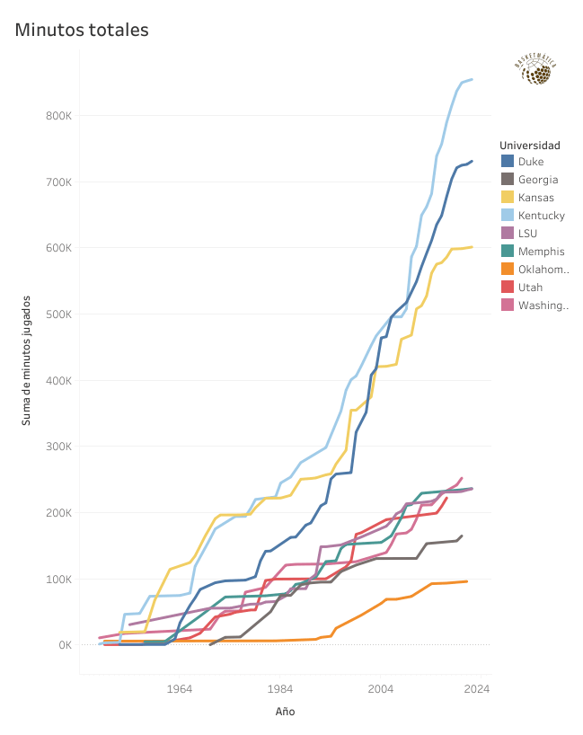

Una vez más, Kentucky y Duke sobresalen, seguidos a cierta distancia por Kansas, y mucho más atrás, el resto de las universidades. Era de esperar obtener resultados similares a los de la primera ronda, puesto que los jugadores seleccionados en esa instancia suelen cumplir con las expectativas o, al menos, alcanzar regularidad en la liga y jugar bastantes años en la NBA. A continuación, actualizamos la clasificación:

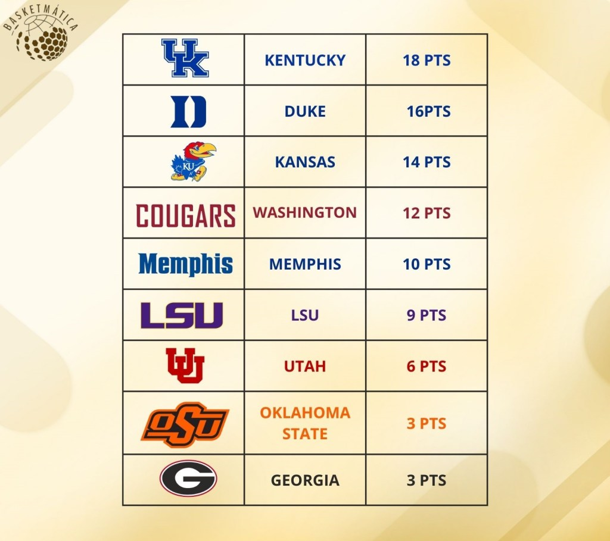

*Clasificación tras la segunda ronda*

## **Ronda 3: Valoración media de los jugadores drafteados**

La valoración es la métrica por excelencia utilizada en Europa para evaluar a los jugadores basándose en diversas métricas simples (puntos, rebotes, asistencias, robos, pérdidas, etc.). Los datos necesarios para calcularla son fácilmente obtenibles y suelen ofrecer una buena aproximación del rendimiento de un jugador en la cancha. Hace unos días, subí a mi perfil de 'X' un hilo hablando en detalle sobre la valoración, así como sobre los inconvenientes que tiene esta métrica. Si te interesa, puedes acceder pinchando en el bloque de aquí debajo:

🐦 [Ver publicación original en X/Twitter](https://twitter.com/basketmatica/status/1804495718205247706)

En esta tercera ronda, calcularemos la valoración media por partido de cada jugador y haremos una media para obtener la valoración media de los jugadores provenientes de cada universidad. Los resultados pueden observarse en la siguiente visualización:

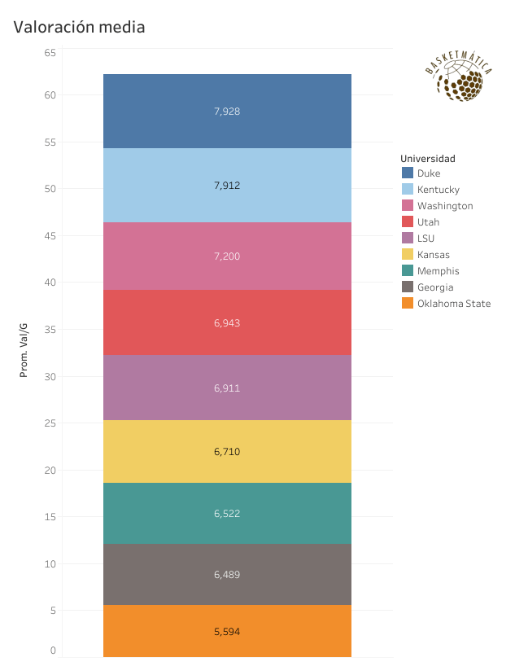

¡Se empieza a poner interesante! Mientras continúa la supremacía de Duke y Kentucky (esta vez llevándose los *Blue Devils* la máxima puntuación), se empieza a apreciar cierta igualdad en esta métrica, con valores muy parejos entre todas las universidades, aunque hay algunas brechas notables (Duke y Kentucky en la cima, y Oklahoma State por debajo). Estos valores de valoración están por debajo de lo que suele considerarse una "buena" valoración (en torno a los 15-20 puntos), pero es importante tener en cuenta que este análisis incluye a todo tipo de jugadores, desde superestrellas (como Kyrie Irving o Grant Hill de Duke) hasta jugadores que no han tenido carreras demasiado exitosas (como Marvin Bagley III, quien fue elegido número 2 del Draft). No es sorprendente que haya más jugadores del segundo grupo que del primero, lo cual reduce la media de manera significativa. Tras la tercera ronda, así queda la clasificación:

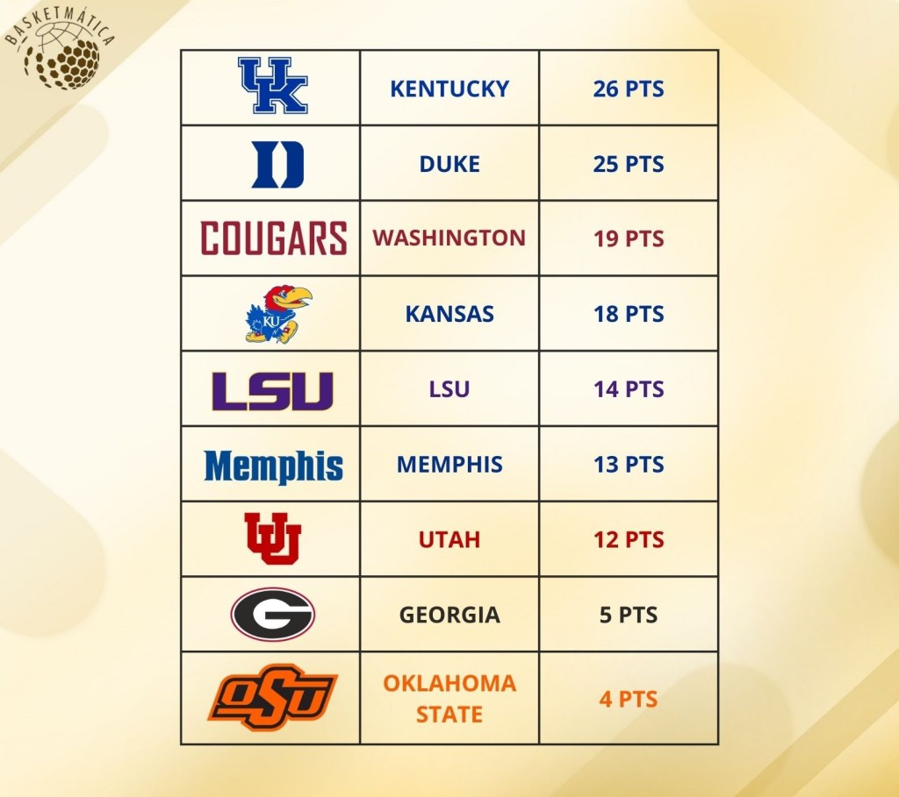

*Clasificación tras la tercera ronda*

## **Ronda 4: Valoración defensiva media de los jugadores drafteados**

Para esta ronda, me he inventado una métrica: la valoración defensiva. El concepto es similar al de la valoración estándar, pero se enfoca únicamente en las estadísticas defensivas: los tapones, los robos y los rebotes defensivos. Uno de los principales problemas de esta métrica es que favorece enormemente a los jugadores interiores, ya que los pívots y los jugadores altos suelen acumular muchos rebotes defensivos y tapones. La defensa es un aspecto muy complicado de medir estadísticamente, pero este será un tema a tratar en el futuro. No obstante, con las métricas disponibles en el conjunto de datos, me pareció una buena idea incluir una valoración que recompensara el buen desempeño defensivo, dentro de las limitaciones existentes. En el siguiente gráfico de barras, podéis ver una comparativa de la valoración defensiva media de los jugadores provenientes de las distintas universidades:

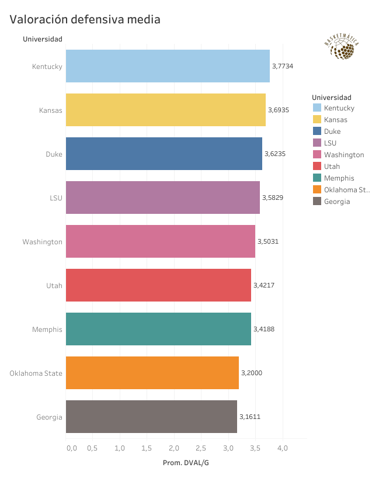

Se puede apreciar una mayor paridad entre los equipos respecto a esta métrica, aunque continúa la tendencia ganadora de Kentucky, Kansas y Duke. Como mencionaba previamente, de estas universidades han salido jugadores interiores que han contribuido a aumentar la media de esta estadística (Anthony Davis o DeMarcus Cousins de Kentucky, Wilt Chamberlain o Joel Embiid de Kansas). Solo quedan dos rondas más para determinar cuál será la mejor universidad de baloncesto, y así luce la clasificación:

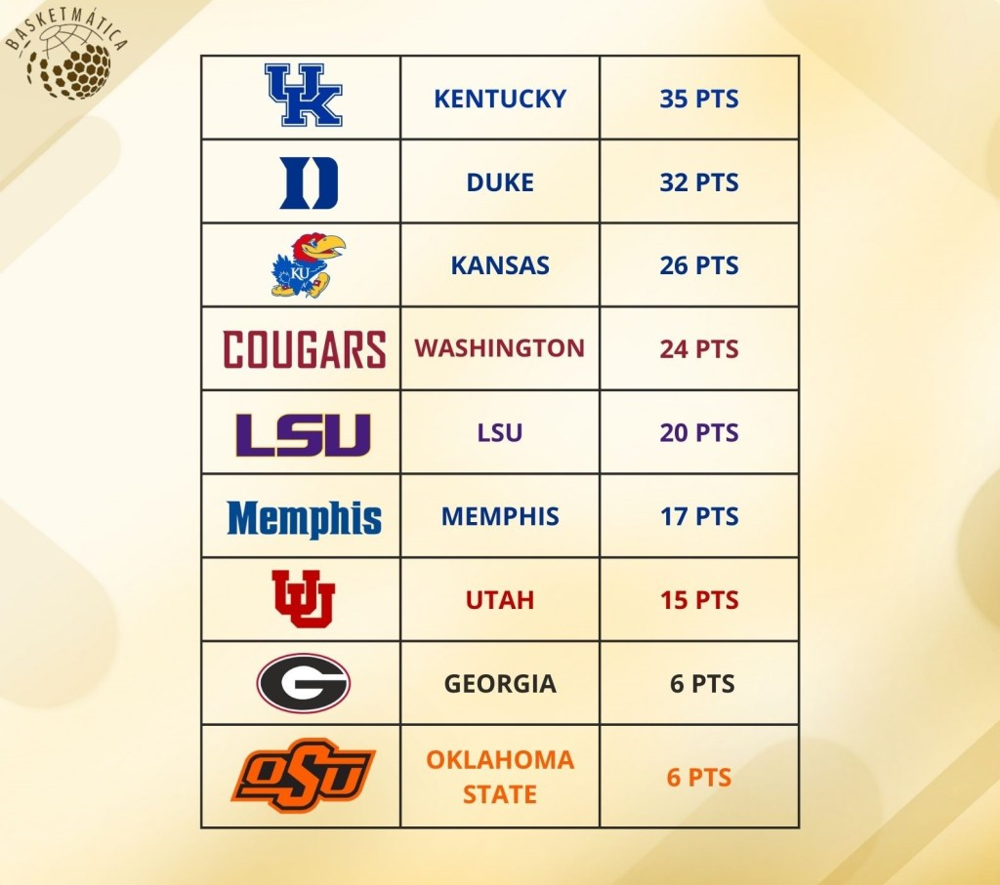

*Clasificación tras la cuarta ronda*

## **Ronda 5: TS% medio de todos los jugadores drafteados**

Llegamos a la penúltima ronda de la competición con una métrica muy interesante para analizar la eficiencia en el tiro de los jugadores: el porcentaje de tiro verdadero (True Shooting Percentage, TS%). A diferencia del eFG%, que ajusta el porcentaje de tiros de campo tradicional para tener en cuenta el valor adicional de los tiros de tres puntos, el TS% es una métrica más completa. Considera todos los puntos anotados, incluyendo tiros de campo y tiros libres, y ajusta estos valores según el número de intentos de tiros de campo y tiros libres. Mientras que el eFG% se centra únicamente en la eficiencia de los tiros de campo, el TS% proporciona una visión más global de la eficiencia del jugador en todas las formas de anotación. Utilizando esta métrica, los grandes lanzadores de tiros libres se ven beneficiados, haciendo justicia a la importancia y peso que este tipo de tiros tiene en la resolución de un partido. A continuación, se presenta un gráfico de burbujas que compara el TS% medio de todos los jugadores de cada universidad:

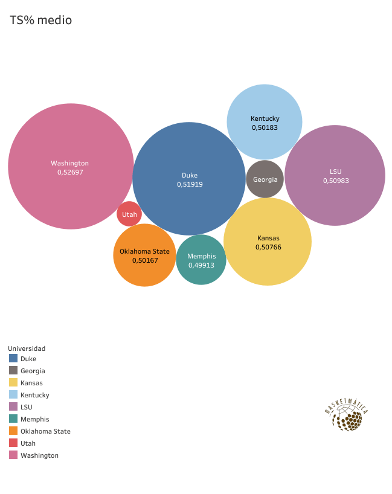

¡Sorpresa! ¡Washington lidera esta estadística! Una universidad de la que han salido jugadores de gran talento anotador, como Isaiah Thomas, Brandon Roy o Dejounte Murray. La igualdad es máxima utilizando esta métrica, aunque, al igual que con la valoración, los valores están por debajo de la media real de la liga (que este último año fue del 58%, aunque ha aumentado casi un 5% en la última década). Con un empate en la primera posición a falta de una ronda, actualizamos la clasificación:

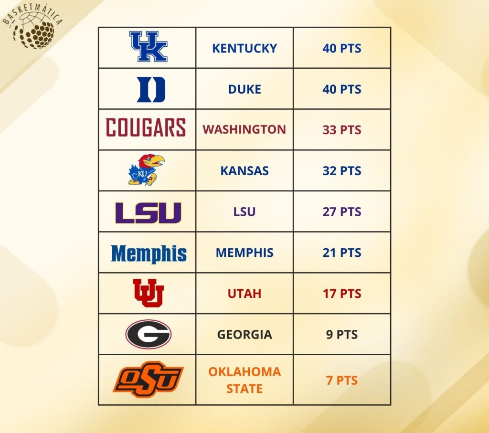

*Clasificación tras la quinta ronda*

## **Ronda 6: Jugadores que han entrado en el *Hall Of Fame* (x2)**

El Salón de la Fama (Hall Of Fame, HOF) es el mayor logro individual que puede obtener un jugador de la NBA. Tras haberse retirado, la NBA puede incluir a un jugador en el HOF si su desempeño en la liga ha sido digno de enmarcar y ha tenido una carrera exitosa. En España contamos con Pau Gasol como miembro del HOF, la mayor leyenda del baloncesto español que dejó huella en la mejor liga del mundo. En esta última ronda, se tendrá en cuenta el número de jugadores de cada universidad que han sido incluidos en el HOF tras finalizar su carrera. Y sí, al ser una métrica sin duda determinante y sinónimo de éxito, he incluido un 'x2' en el título para indicar que esta ronda valdrá doble. El siguiente diagrama en árbol muestra los resultados:

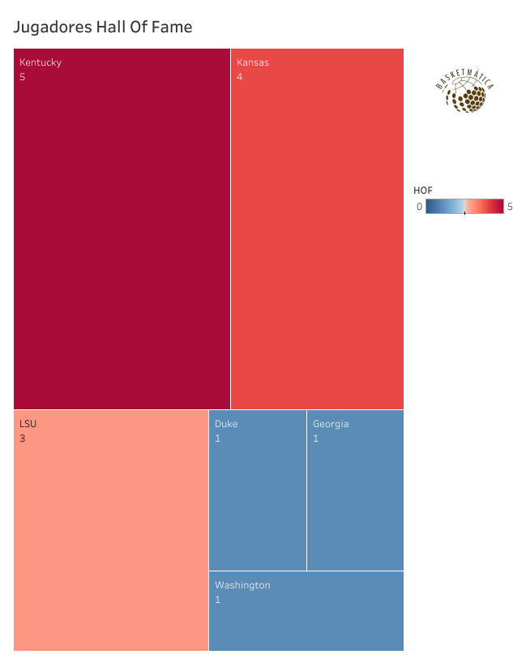

No es casualidad que la universidad que ha dominado de principio a fin en (casi) todas las rondas sea la misma que ha producido más jugadores pertenecientes al HOF: Dan Issel, Louie Dampier, Cliff Hagan, Frank Ramsey y Pat Riley. Hasta cinco jugadores de Kentucky han sido nombrados miembros del HOF, definiendo a la universidad situada en Lexington como la mejor fábrica de talentos del mundo. Y si mi análisis no os ha convencido del todo, aquí os dejo otros datos que respaldan al campeón:

-   Ocho campeonatos de la NCAA.
-   Mejor porcentaje de victorias de todos los tiempos.
-   Mayor cantidad de victorias de todos los tiempos.

La clasificación final queda así:

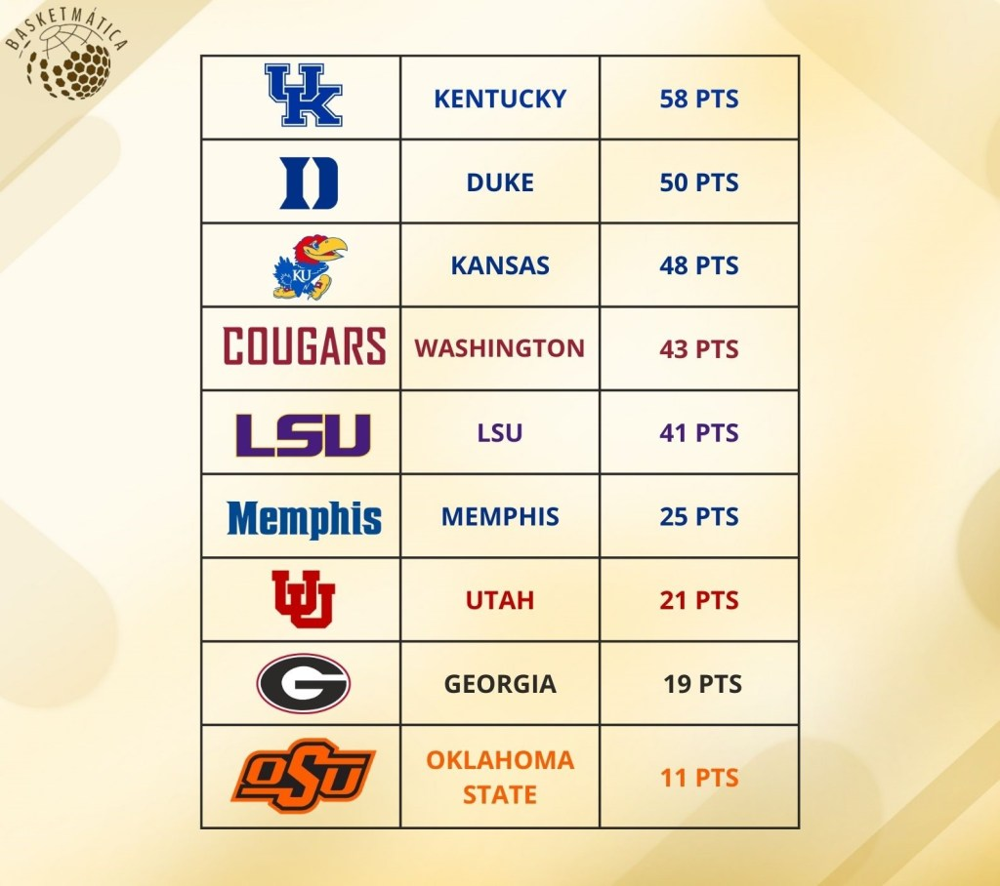

*Clasificación tras la sexta ronda*

Nuestro análisis revela que el éxito en la NBA no solo depende del talento individual de los jugadores, sino también del entorno formativo que proporcionan las universidades. Universidades con programas de baloncesto robustos y bien estructurados, entrenadores experimentados, y un enfoque integral en el desarrollo de los jugadores tienden a producir talentos que brillan en la NBA. Sin embargo, el camino hacia una carrera exitosa es multifacético y cada jugador tiene su propia historia de esfuerzo, dedicación y superación. La lección aquí es clara: el talento necesita ser nutrido, y las universidades desempeñan un papel crucial en ese proceso.

Si quieres ser un experto obteniendo valor de los datos que nos deja el fantástico mundo del baloncesto, suscríbete aquí debajo para no perderte ninguno de mis análisis. ¿Quieres profundizar en el código detrás de este análisis? Está disponible en GitHub. [Haz click aquí para verlo](https://github.com/Basketmatica/basketmatica-picksncaa). Nos vemos en el siguiente,

Basketmática.
