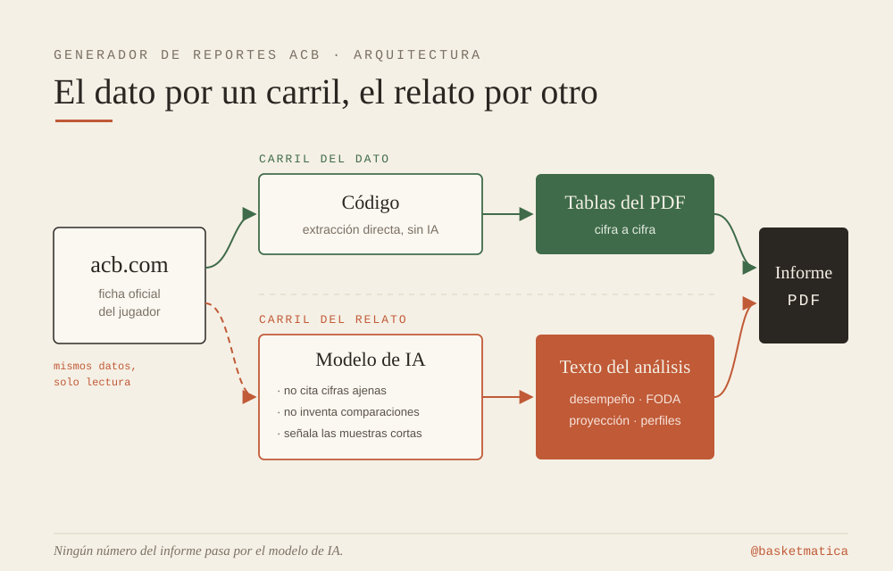
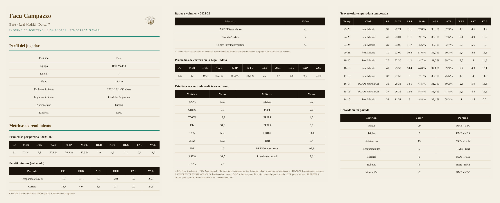

*Escribe un nombre y descarga un scouting report en PDF. Los datos, de acb.com; la IA solo redacta, y bajo reglas. Así funciona la nueva herramienta de Basketmática.*

Desde hoy hay una herramienta nueva en Basketmática: el [Generador de Reportes ACB](/herramientas/generador-reportes-acb/). Escribes el nombre de un jugador de la Liga Endesa y en menos de un minuto descargas un informe de scouting en PDF: perfil, promedios oficiales, estadísticas avanzadas, trayectoria completa temporada a temporada con el club de cada año, récords en un partido y un análisis FODA con proyección. Gratis y sin registro.

La herramienta es la conclusión de este artículo, no su argumento. El argumento es cómo está construida, porque en 2026 «informe generado con IA» puede significar dos cosas muy distintas, y la diferencia entre ambas es exactamente la diferencia entre un dato y una alucinación.

## El principio: separar el dato del relato

La decisión de diseño central es que ningún número del informe pasa por un modelo de IA. Las tablas se construyen con código directamente desde los datos publicados en la ficha oficial del jugador en acb.com: lo que ves en el PDF es lo que publica la fuente, celda a celda. La IA interviene después y solo en una cosa: redactar el texto analítico —desempeño, FODA, proyección, perfiles comparables— a partir de esos datos, con reglas estrictas: no puede citar una cifra que no esté en los datos de entrada, no puede comparar una métrica de temporada con un promedio de carrera que no exista, y debe tratar las muestras cortas como lo que son. Si un dato falta, la sección se omite; nunca se rellena.

¿Por qué tanta insistencia? Porque un informe de scouting vale exactamente lo que vale su peor número. Un porcentaje inventado con aspecto plausible es indetectable a simple vista y letal para la credibilidad. La arquitectura elimina el problema de raíz en lugar de confiar en que el modelo se porte bien.

## La materia prima: las avanzadas oficiales de la ACB

La segunda pieza es una gran desconocida: en cada ficha de jugador, acb.com publica un bloque de estadísticas avanzadas oficiales. Incluye los Cuatro Factores (eFG%, ORB%, TOV%, FTr), el porcentaje de tiro real (TS%), el porcentaje de asistencias (AST%), los puntos por cada 100 posesiones y las posesiones por 40 minutos. El informe las trae tal cual, con su leyenda, sin fórmulas caseras de por medio. Las únicas métricas calculadas por la herramienta —la normalización per-40 minutos y ratios como asistencias por pérdida— son aritmética simple sobre esos mismos promedios oficiales, y aparecen siempre etiquetadas como «(calculado)» para que nadie confunda dato de fuente con dato derivado.

## Un ejemplo real: Campazzo, 2025-26

Mejor que describir el informe es [leer uno](/files/campazzo-report-acb-1.pdf). El de Facundo Campazzo cuenta, en tablas, una historia con matices. Su valoración de la 2025-26 (11,2) queda por debajo de su promedio de carrera en ACB (13,5), y la serie reciente de la trayectoria —17,0 en la 23-24, 15,2 en la 24-25, 11,2 en la 25-26— dibuja un descenso sostenido desde el pico. Al mismo tiempo, las avanzadas oficiales matizan el titular fácil: un TS% del 56,8 y un AST% del 31,5 siguen describiendo a un organizador eficiente y de altísimo uso creativo, con 2,3 asistencias por pérdida. Diez temporadas de trayectoria en la misma tabla —incluidas las dos cesiones al UCAM Murcia— permiten situar cada cifra en su contexto. Ese es el tipo de lectura que el informe entrega en un minuto y que montar a mano lleva una tarde.

Con la 2026-27 a punto de arrancar, el generador es útil hoy —con la 2025-26 completa como temporada de referencia— y se actualizará solo cuando empiece la competición, sin tocar nada.

## Lo que la herramienta no mide

Como cualquier análisis de Basketmática, este también declara sus límites. La cobertura se ciñe a la actualidad: los informes son de jugadores en activo en la Liga Endesa, no de jugadores retirados. El informe trabaja con la estadística pública de acb.com: no hay *tracking*, no hay datos de impacto defensivo individual más allá de robos, tapones y sus porcentajes, y no hay *on/off* ni contexto de quintetos. El texto analítico lo redacta un modelo de IA de pesos abiertos y, aunque opera bajo reglas de rigor y sobre datos verificables, es un punto de partida para la conversación, no un veredicto: las tablas son la parte del informe que firma la fuente; el análisis, la parte que invita a discutir. Y las muestras cortas —temporadas de pocos partidos, porcentajes sobre pocos intentos— se señalan como tales en lugar de esconderse.

## Cierre

El Generador de Reportes ACB es la traducción a herramienta del principio que ordena todo lo demás en esta web: solo los números, y lo que de verdad dicen. Los datos van por un carril y el relato por otro, cada métrica declara su origen, y los límites se dicen en voz alta. [Pruébalo](/herramientas/generador-reportes-acb/) con el jugador de la Liga Endesa que quieras y, si el informe te dice algo que no sabías o encuentras algo mejorable, [cuéntamelo](https://x.com/basketmatica): la herramienta está hecha para seguir mejorando.

*El [Generador de Reportes NBA](/herramientas/generador-reportes-nba/), su hermano mayor, funciona con la misma arquitectura.*
