¡Bienvenido al Glosario de Basketball Analytics! Este recurso está diseñado para ayudarte a descubrir y entender las métricas y conceptos clave que están transformando el análisis del baloncesto moderno. Aquí encontrarás definiciones claras y ejemplos prácticos de las estadísticas avanzadas más utilizadas por analistas, entrenadores y aficionados de todo el mundo.

Este glosario se actualiza regularmente con nuevos términos que vamos explorando en nuestros hilos de X y artículos. Puedes acceder a mi cuenta de X pulsando [aquí](https://x.com/basketmatica). Ya seas un principiante en el análisis de datos aplicado al baloncesto, un experto buscando afinar tus conocimientos o simplemente un amante de este deporte, este glosario es tu punto de referencia. ¡Espero que encuentres esta herramienta útil y educativa! Te dejo un índice aquí abajo para que encuentres el término que estás buscando fácilmente.

ÍNDICE DEL GLOSARIO
<ol><li><a class="wp-block-table-of-contents__entry" href="/glosario/#2-point-rate-2pr">2 Point Rate (2PR)</a></li><li><a class="wp-block-table-of-contents__entry" href="/glosario/#3-point-rate-3pr">3 Point Rate (3PR)</a></li><li><a class="wp-block-table-of-contents__entry" href="/glosario/#adjusted-plus-minus-apm">Adjusted Plus-Minus (APM)</a></li><li><a class="wp-block-table-of-contents__entry" href="/glosario/#assist-percentage-ast">Assist Percentage (AST%)</a></li><li><a class="wp-block-table-of-contents__entry" href="/glosario/#block-percentage-blk">Block Percentage (BLK%)</a></li><li><a class="wp-block-table-of-contents__entry" href="/glosario/#bottom-up-metrics">Bottom Up Metrics</a></li><li><a class="wp-block-table-of-contents__entry" href="/glosario/#defensive-plus-minus-dbpm">Defensive Plus-Minus (DBPM)</a></li><li><a class="wp-block-table-of-contents__entry" href="/glosario/#defensive-rating-defrtg">Defensive Rating (DefRtg)</a></li><li><a class="wp-block-table-of-contents__entry" href="/glosario/#defensive-rebound-percentage-drb">Defensive Rebound Percentage (DRB%)</a></li><li><a class="wp-block-table-of-contents__entry" href="/glosario/#defensive-turnover-percentage-dtov">Defensive Turnover Percentage (DTOV%)</a></li><li><a class="wp-block-table-of-contents__entry" href="/glosario/#eight-factors">Dunk Score</a></li><li><a class="wp-block-table-of-contents__entry" href="/glosario/#effective-field-goal-percentage-efg">Effective Field Goal Percentage (eFG%)</a></li><li><a class="wp-block-table-of-contents__entry" href="/glosario/#eight-factors">Eight Factors</a></li><li><a class="wp-block-table-of-contents__entry" href="/glosario/#fgm-ast">FGM %AST</a></li><li><a class="wp-block-table-of-contents__entry" href="/glosario/#fgm-uast">FGM %UAST</a></li><li><a class="wp-block-table-of-contents__entry" href="/glosario/#four-factors">Four Factors</a></li><li><a class="wp-block-table-of-contents__entry" href="/glosario/#free-throw-rate-ftr">Free Throw Rate (FTR)</a></li><li><a class="wp-block-table-of-contents__entry" href="/glosario/#net-rating-netrtg">Net Rating (NetRtg)</a></li><li><a class="wp-block-table-of-contents__entry" href="/glosario/#offensive-plus-minus-obpm">Offensive Plus-Minus (OBPM)</a></li><li><a class="wp-block-table-of-contents__entry" href="/glosario/#defensive-rating-defrtg">Offensive Rating (OffRtg)</a></li><li><a class="wp-block-table-of-contents__entry" href="/glosario/#offensive-rebound-percentage-orb">Offensive Rebound Percentage (ORB%)</a></li><li><a class="wp-block-table-of-contents__entry" href="/glosario/#pace">PACE</a></li><li><a class="wp-block-table-of-contents__entry" href="/glosario/#player-impact-estimate-pie">Player Efficiency Rating (PER)</a></li><li><a class="wp-block-table-of-contents__entry" href="/glosario/#player-impact-estimate-pie">Player Impact Estimate (PIE)</a></li><li><a class="wp-block-table-of-contents__entry" href="/glosario/#plus-minus">Plus-Minus (+/-)</a></li><li><a class="wp-block-table-of-contents__entry" href="/glosario/#points-per-attempt-ppa">Points Per Attempt (PPA)</a></li><li><a class="wp-block-table-of-contents__entry" href="/glosario/#points-per-attempt-ppa">Posesiones (POS)</a></li><li><a class="wp-block-table-of-contents__entry" href="/glosario/#raptor">RAPTOR</a></li><li><a class="wp-block-table-of-contents__entry" href="/glosario/#real-plus-minus-rpm">Real Plus-Minus (RPM)</a></li><li><a class="wp-block-table-of-contents__entry" href="/glosario/#shot-making-efficiency">Shot Making Efficiency</a></li><li><a class="wp-block-table-of-contents__entry" href="/glosario/#steal-percentage-stl">Steal Percentage (STL%)</a></li><li><a class="wp-block-table-of-contents__entry" href="/glosario/#top-down-metrics">Top Down Metrics</a></li><li><a class="wp-block-table-of-contents__entry" href="/glosario/#true-shooting-percentage-ts">True Shooting Percentage (TS%)</a></li><li><a class="wp-block-table-of-contents__entry" href="/glosario/#turnover-percentage-tov">Turnover Percentage (TOV%)</a></li><li><a class="wp-block-table-of-contents__entry" href="/glosario/#usage-percentage-usg">Usage Percentage (USG%)</a></li><li><a class="wp-block-table-of-contents__entry" href="/glosario/#valoracion-val">Valoración (VAL)</a></li><li><a class="wp-block-table-of-contents__entry" href="/glosario/#win-shares-ws">Win Shares (WS)</a></li></ol>

#### **2 Point Rate (2PR)**

**Definición**: Mide la proporción de tiros de 2 puntos respecto al total de tiros intentados por un jugador o equipo.

**Fórmula:**

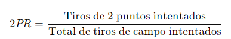

**Es útil para**: Evaluar el enfoque ofensivo de un jugador o equipo, especialmente en comparación con su tendencia a lanzar desde el perímetro.

**Ampliación/Aplicación:** [https://basketmatica.com/2024/06/13/como-se-corono-lebron-james-como-maximo-anotador-de-la-historia/#:~:text=Ratios%3A,de%2010%20temporadas).](/2024/06/13/como-se-corono-lebron-james-como-maximo-anotador-de-la-historia/#:~:text=Ratios%3A,de%2010%20temporadas\).)

#### **3 Point Rate (3PR)**

**Definición**: Mide la proporción de tiros de 3 puntos respecto al total de tiros intentados por un jugador o equipo.

**Fórmula:**

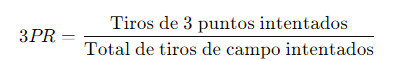

**Es útil para**: Analizar la dependencia de un jugador o equipo en los tiros de larga distancia y su estrategia ofensiva.

**Ampliación/Aplicación:** [https://x.com/basketmatica/status/1818345457757688107](https://x.com/basketmatica/status/1818345457757688107)

#### **Adjusted Plus-Minus (APM)**

**Definición**: Ajusta el Plus-Minus básico al considerar la calidad de los compañeros de equipo y oponentes, usando modelos estadísticos para aislar el impacto individual de un jugador.

**Es útil para**: Medir el valor verdadero de un jugador más allá de su entorno, proporcionando una evaluación más justa de su impacto en el juego.

**Ampliación/Aplicación:** [https://x.com/basketmatica/status/1828039347926335824](https://x.com/basketmatica/status/1828039347926335824)

#### **Assist Percentage (AST%)**

**Definición**: Calcula el porcentaje de tiros de campo convertidos por un equipo que provienen de asistencias realizadas por un jugador.

**Fórmula:**

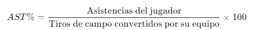

**Es útil para**: Evaluar la capacidad de un jugador para crear oportunidades de anotación para sus compañeros, reflejando su rol en la distribución del juego. También se puede calcular para el equipo.

**Ampliación/Aplicación:** [https://x.com/basketmatica/status/1818345462295908558](https://x.com/basketmatica/status/1818345462295908558)

#### Block Percentage (BLK%)

**Definición:** Métrica que estima el porcentaje de intentos de tiro de campo del equipo rival que un jugador bloquea mientras está en cancha. Se ajusta en función de los minutos jugados y el volumen de tiros intentados por los oponentes para proporcionar una medición relativa del impacto en protección del aro.

**Fórmula:**

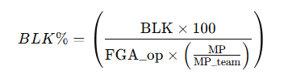

**Es útil para:** Evaluar la capacidad de un jugador como protector del aro más allá del número total de tapones. Permite comparar jugadores con diferentes roles y tiempos de juego, identificando a aquellos que realmente disuaden intentos de tiro cerca del aro.

**Ampliación/Aplicación:** [https://x.com/basketmatica/status/1903766101458129336](https://x.com/basketmatica/status/1903766101458129336)

#### **Bottom Up Metrics**

**Definición**: Métricas que se centran en la producción individual de un jugador, como la valoración (VAL).

**Es útil para**: Analizar el rendimiento individual de un jugador de manera aislada, sin considerar el contexto del equipo.

**Ampliación/Aplicación:** [https://x.com/basketmatica/status/1816082554312609954](https://x.com/basketmatica/status/1816082554312609954)

#### **Defensive Plus-Minus (DBPM)**

**Definición**: Métrica complementaria al OBPM que estima el impacto defensivo de un jugador por cada 100 posesiones, también desarrollada por Basketball Reference. A diferencia del OBPM, el DBPM depende más del contexto del equipo, ya que las estadísticas individuales defensivas son más limitadas y menos representativas del impacto real.

**Es útil para**: Tener una referencia aproximada del impacto defensivo de un jugador en comparación con el promedio de la liga. Aunque menos precisa que su contraparte ofensiva, ayuda a detectar tendencias y comparar aportes defensivos entre jugadores con roles distintos.

#### **Defensive Rating (DefRtg)**

**Definición**: Mide la cantidad de puntos permitidos por un equipo cada 100 posesiones.

**Fórmula**: ([Explicación de por qué se pondera a 100 posesiones](https://x.com/basketmatica/status/1869867724874129710))

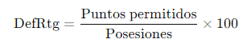

**Es útil para**: Esta métrica es crucial para comprender la eficacia de un jugador o equipo para evitar que sus oponentes anoten, lo que la hace valiosa a la hora de analizar los enfrentamientos defensivos y la defensa general del equipo. Además, al medirse cada 100 posesiones, es ideal para comparar con otros equipos o jugadores.

**Ampliación/Aplicación**: [https://x.com/basketmatica/status/1848769588194091220](https://x.com/basketmatica/status/1848769588194091220)

#### **Defensive Rebound Percentage (DRB%)**

**Definición**: Determina el porcentaje de rebotes defensivos disponibles que un jugador o equipo captura.

**Fórmula:**

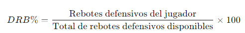

**Es útil para**: Evaluar la capacidad de un jugador o equipo para asegurar posesiones después de que el oponente falle un tiro.

**Ampliación/Aplicación:** [https://x.com/basketmatica/status/1809359563503857952](https://x.com/basketmatica/status/1809359563503857952)

#### **Defensive Turnover Percentage (DTOV%)**

**Definición**: Mide el porcentaje de posesiones de un jugador o equipo rival que terminan en pérdida de balón provocada por la defensa.

**Fórmula:**

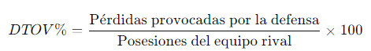

**Es útil para**: Evaluar la efectividad defensiva de un jugador o equipo en términos de generar pérdidas de balón del rival.

**Ampliación/Aplicación:** [https://x.com/basketmatica/status/1809359563503857952](https://x.com/basketmatica/status/1809359563503857952)

#### **Dunk Score**

**Definición**: Métrica desarrollada por NBA Stats basada en IA y datos de tracking que mide la calidad de un mate realizado por un jugador durante un partido o temporada

**Es útil para**: Evaluar de manera objetiva la calidad de un mate, enriqueciendo las narrativas alrededor del juego y desglosando una acción tan compleja como es un mate en parámetros analizables (salto, estilo, potencia y contexto de los defensores).

**Ampliación/Aplicación:** [https://x.com/basketmatica/status/1863192053871444032](https://x.com/basketmatica/status/1863192053871444032)

#### **Effective Field Goal Percentage (eFG%)**

**Definición**: Mide la eficiencia en el tiro de un jugador, dando mayor peso a los tiros de tres puntos debido a su mayor valor.

**Fórmula:**

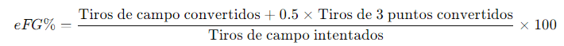

**Es útil para**: Comparar la eficiencia de tiro considerando el valor adicional de los triples, ofreciendo una evaluación más precisa que el porcentaje de tiro simple.

**Ampliación/Aplicación:** [https://x.com/basketmatica/status/1809359544394420729](https://x.com/basketmatica/status/1809359544394420729)

#### **Eight Factors**

**Definición**: Expansión de los Four Factors de Dean Oliver, añadiendo las contrapartes defensivas de cada factor. Incluye Effective Field Goal Percentage, Opponent's eFG%, Free Throw Rate, Opponent's Free Throw Rate, Offensive Rebound Percentage, Defensive Rebound Percentage, Turnover Percentage y Defensive Turnover Percentage.

**Es útil para**: Evaluar de manera integral el rendimiento de un equipo, considerando tanto su ataque como su defensa.

**Ampliación/Aplicación:** [https://x.com/basketmatica/status/1809359563503857952](https://x.com/basketmatica/status/1809359563503857952)

#### FGM %AST

**Definición:** Mide la proporción de los tiros de campo anotados que provienen de una asistencia.

**Fórmula:**

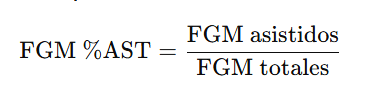

**Es útil para:** Medir cuánto del ataque de un jugador o equipo depende de la creación colectiva y del movimiento de balón. Un valor alto suele indicar buen juego en equipo y circulación de balón efectiva.

**Ampliación/Aplicación:** [https://x.com/basketmatica/status/1934224789121499286](https://x.com/basketmatica/status/1934224789121499286)

#### FGM %UAST

**Definición:** Mide la proporción de los tiros de campo anotados que fueron generados sin asistencia.

**Fórmula:**

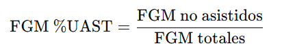

**Es útil para:** Evaluar la capacidad de creación individual de un jugador o equipo. Un valor alto refleja mayor volumen de jugadas de uno contra uno, creación propia o situaciones de aclarado (ISO).

**Ampliación/Aplicación:** [https://x.com/basketmatica/status/1934224789121499286](https://x.com/basketmatica/status/1934224789121499286)

#### **Four Factors**

**Definición**: Concepto creado por Dean Oliver que engloba cuatro métricas clave que tienen una alta correlación con la victoria en un juego: Effective Field Goal Percentage (40%), Free Throw Rate (15%), Offensive Rebound Percentage (20%), y Turnover Percentage (25%).

**Es útil para**: Analizar las áreas críticas que determinan el éxito de un equipo en un partido. Entre paréntesis en la definición figuran los pesos aproximados que Dean Oliver asignaba a cada factor.

**Ampliación/Aplicación:** [https://x.com/basketmatica/status/1809359535561216002](https://x.com/basketmatica/status/1809359535561216002)

#### **Free Throw Rate (FTR)**

**Definición**: Calcula la frecuencia con la que un jugador o equipo va a la línea de tiros libres en relación con los tiros de campo intentados.

**Fórmula:**

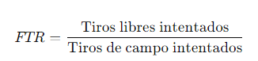

**Es útil para**: Evaluar la capacidad de un jugador o equipo para generar oportunidades en la línea de tiros libres, lo que puede ser clave en partidos apretados.

**Ampliación/Aplicación:** [https://x.com/basketmatica/status/1809359551227113715](https://x.com/basketmatica/status/1809359551227113715)

#### **Net Rating (NetRtg)**

**Definición**: Métrica que mide la diferencia entre los puntos anotados y los puntos recibidos por un equipo por cada 100 posesiones.

**Fórmula**:

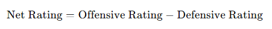

**Es útil para**: Evaluar de forma integral el rendimiento de un equipo, combinando su eficiencia ofensiva y defensiva en una sola métrica. Al estar normalizada por 100 posesiones, permite comparar fácilmente equipos con diferentes ritmos de juego.

**Ampliación/Aplicación**: [https://x.com/basketmatica/status/1918994269546656114](https://x.com/basketmatica/status/1918994269546656114)

#### **Offensive Plus-Minus (OBPM)**

**Definición**: Métrica desarrollada por Basketball Reference que estima la contribución ofensiva de un jugador por cada 100 posesiones, ajustando por el contexto del equipo y el ritmo de juego. Se basa en un modelo que incorpora estadísticas individuales (puntos, asistencias, pérdidas, etc.) y su impacto estimado en el rendimiento ofensivo global del equipo cuando el jugador está en cancha.

**Es útil para**: Cuantificar el impacto ofensivo de un jugador de forma más completa que las estadísticas tradicionales. Permite comparar el valor ofensivo de jugadores con diferentes roles y minutos, identificando a aquellos que realmente elevan el rendimiento del equipo cuando están en pista.

#### **Offensive Rating (OffRtg)**

**Definición**: Mide la cantidad de puntos anotados por un equipo cada 100 posesiones.

**Fórmula**: ([Explicación de por qué se pondera a 100 posesiones](https://x.com/basketmatica/status/1869867724874129710))

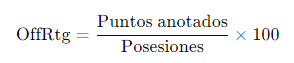

**Es útil para**: Es particularmente útil para comparar el rendimiento ofensivo entre diferentes jugadores o equipos, ya que se ajusta el número de posesiones por fines comparativos. Se utilizan para identificar qué jugadores o alineaciones están contribuyendo más a la producción ofensiva del equipo.

**Ampliación/Aplicación**: [https://x.com/basketmatica/status/1848769588194091220](https://x.com/basketmatica/status/1848769588194091220)

#### **Offensive Rebound Percentage (ORB%)**

**Definición**: Determina el porcentaje de rebotes ofensivos disponibles que un jugador o equipo captura.

**Fórmula:**

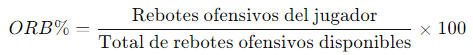

**Es útil para**: Evaluar la capacidad de un equipo o jugador para extender posesiones y crear segundas oportunidades de anotación.

**Ampliación/Aplicación:** [https://x.com/basketmatica/status/1809359551227113715](https://x.com/basketmatica/status/1809359551227113715)

#### **PACE**

**Definición**: Mide el número de posesiones que un equipo juega por cada 48 minutos (ponderación NBA), indicando la velocidad del juego.

**Fórmula:**

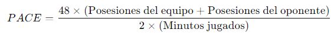

**Es útil para**: Analizar la dinámica de un equipo en cuanto a su estilo de juego, ya sea que prefiera un ritmo más rápido o uno más controlado.

**Ampliación/Aplicación:** [https://x.com/basketmatica/status/1818345459838067053](https://x.com/basketmatica/status/1818345459838067053)

#### **Player Efficiency Rating (PER)**

**Definición**: Evalúa el rendimiento de un jugador por minuto en cancha, considerando diversas estadísticas positivas y negativas. Un promedio de PER es 15.

**Es útil para**: Evaluar de manera completa la contribución de un jugador, yendo más allá de las métricas de rendimiento tradicionales. Además, permite comparar jugadores de diferentes posiciones y roles, ya que ajusta por minutos jugados y las estadísticas promedio de la NBA.

**Ampliación/Aplicación:** [https://x.com/basketmatica/status/1838153088521142778](https://x.com/basketmatica/status/1838153088521142778)

#### **Player Impact Estimate (PIE)**

**Definición**: Mide la contribución global de un jugador en un partido, incorporando la mayoría de las estadísticas del box score para calcular el porcentaje de eventos del partido en los que el jugador ha tenido un impacto.

**Es útil para**: Evaluar la influencia general de un jugador en el resultado de un partido, considerando tanto su producción ofensiva como defensiva.

**Ampliación/Aplicación:** [https://x.com/basketmatica/status/1816082569412137264](https://x.com/basketmatica/status/1816082569412137264)

#### **Plus-Minus (+/-)**

**Definición**: Mide el impacto de un jugador en el marcador mientras está en la cancha, calculando la diferencia de puntos del equipo durante los minutos que el jugador está en pista.

**Es útil para**: Evaluar cómo cambia el rendimiento de un equipo con un jugador en particular en la cancha, aunque no considera el contexto de los compañeros y oponentes.

**Fórmula:**

**Ampliación/Aplicación:** [https://x.com/basketmatica/status/1828039339936215291](https://x.com/basketmatica/status/1828039339936215291)

#### **Points Per Attempt (PPA)**

**Definición**: Calcula la cantidad de puntos que un jugador promedia por cada tiro de campo que intenta.

**Fórmula:**

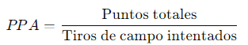

**Es útil para**: Medir la eficiencia en la anotación de un jugador, comparando cuántos puntos obtiene en relación a la cantidad de tiros que realiza.

**Ampliación/Aplicación:** [https://basketmatica.com/2024/06/13/como-se-corono-lebron-james-como-maximo-anotador-de-la-historia/#:~:text=Ratios%3A,de%2010%20temporadas).](/2024/06/13/como-se-corono-lebron-james-como-maximo-anotador-de-la-historia/#:~:text=Ratios%3A,de%2010%20temporadas\).)

#### **Posesiones (POS)**

**Definición**: Calcula el número de oportunidades que un equipo o jugador tiene para realizar una jugada. Se usa para medir el ritmo del juego y evaluar la eficiencia de un equipo o jugador.

**Fórmula:** ([Explicación de por qué no uso el factor 0,96](https://x.com/basketmatica/status/1841114749519741018) y [qué significa el multiplicador 0.4](https://x.com/basketmatica/status/1948051932029001903))

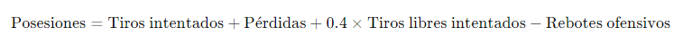

**Es útil para**: Evaluar el rendimiento de un equipo o jugador en relación con las oportunidades que tienen para anotar. Permite comparar el ritmo, la eficiencia ofensiva y defensiva de los equipos, ya que la posesión determina las oportunidades disponibles para anotar puntos. Importante anotar que un rebote ofensivo no genera una nueva posesión, sencillamente extiende la actual (por ello se restan los rebotes ofensivos en la fórmula).

**Ampliación/Aplicación:** [https://x.com/basketmatica/status/1848769578127806966](https://x.com/basketmatica/status/1848769578127806966)

#### **RAPTOR**

**Definición**: Métrica de impacto desarrollada por FiveThirtyEight que estima la contribución ofensiva (ORAPTOR) y defensiva (DRAPTOR) de un jugador por cada 100 posesiones. Combina información de tracking data, estadísticas del boxscore, datos play-by-play y Plus-Minus. Su objetivo es aislar el efecto real del jugador sobre el rendimiento del equipo, corrigiendo por calidad de compañeros y rivales.

**Es útil para**: Evaluar el impacto global o contextualizado de un jugador en ambos extremos de la cancha. Permite analizar ajustes de rotación, valoraciones comparativas históricas o proyectadas y detección de ventajas en emparejamientos ofensivos y defensivos.

**Ampliación/Aplicación**: [https://x.com/basketmatica/status/1983625603812118537](https://x.com/basketmatica/status/1983625603812118537)

#### **Real Plus-Minus (RPM)**

**Definición**: Mide el impacto global de un jugador en el rendimiento de su equipo, tanto en defensa como en ataque. Utiliza un modelo estadístico que ajusta la contribución individual de un jugador según la calidad de sus compañeros y oponentes.

**Es útil para**: Ofrecer una estimación más precisa del verdadero valor de un jugador, separando su impacto del de los demás en la cancha.

**Ampliación/Aplicación:** [https://x.com/basketmatica/status/1828039350086463563](https://x.com/basketmatica/status/1828039350086463563)

#### **Shot Making Efficiency**

**Definición:** Métrica desarrollada por BBall Index que mide el rendimiento en el tiro de un jugador en comparación con lo esperado. Calcula un eFG% esperado basado en la dificultad del tiro, considerando factores como localización, tipo de tiro y nivel de contestación, y lo compara con el eFG% real.

**Es útil para:** Evaluar con precisión la efectividad de un jugador, ajustando los resultados según el promedio de intentos de la liga. Esto permite minimizar sesgos derivados de tamaños de muestra pequeños y tener en cuenta múltiples factores que influyen en la calidad del tiro.

**Amplicación/Aplicación:** [https://x.com/basketmatica/status/1880950972861591804](https://x.com/basketmatica/status/1880950972861591804)

#### **Steal Percentage (STL%)**

**Definición:** Métrica que estima el porcentaje de posesiones del equipo rival que terminan en un robo del jugador mientras está en pista. Se ajusta por el ritmo de juego y los minutos disputados para ofrecer una medición más precisa del impacto en generación de pérdidas.

**Fórmula:**

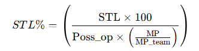

**Es útil para:** Determinar qué jugadores fuerzan más pérdidas en defensa de manera eficiente, sin depender únicamente del conteo total de robos. Es clave para identificar defensores disruptivos en el perímetro o en líneas de pase, ajustando las comparaciones según el contexto de juego.

**Ampliación/Aplicación:** [https://x.com/basketmatica/status/1903766108357664824](https://x.com/basketmatica/status/1903766108357664824)

#### **Top Down Metrics**

**Definición**: Métricas que evalúan el rendimiento de un jugador en el contexto del rendimiento del equipo completo, como el Plus-Minus.

**Es útil para**: Analizar cómo el rendimiento individual de un jugador se integra en el éxito global del equipo, proporcionando una visión global de su impacto.

**Ampliación/Aplicación:** [https://x.com/basketmatica/status/1816082554312609954](https://x.com/basketmatica/status/1816082554312609954)

#### **True Shooting Percentage (TS%)**

**Definición**: Mide la eficiencia en el tiro de un jugador considerando tiros de campo, triples y tiros libres, proporcionando una visión más completa que el eFG%.

**Fórmula:**

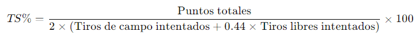

**Es útil para**: Evaluar la eficiencia total en el tiro, integrando tiros de campo, triples y tiros libres, lo que permite comparar jugadores con diferentes estilos de anotación.

**Ampliación/Aplicación:** [https://x.com/basketmatica/status/1819680396662984860](https://x.com/basketmatica/status/1819680396662984860)

#### **Turnover Percentage (TOV%)**

**Definición**: Mide el porcentaje de posesiones de un jugador o equipo que terminan en pérdida de balón.

**Fórmula:**

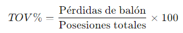

**Es útil para**: Evaluar la seguridad con la que un jugador o equipo maneja el balón y cómo influye en la eficiencia de las posesiones de su equipo.

**Ampliación/Aplicación:** [https://x.com/basketmatica/status/1809359548433723871](https://x.com/basketmatica/status/1809359548433723871)

#### **Usage Percentage (USG%)**

**Definición**: Indica el porcentaje de jugadas ofensivas de un equipo en las que un jugador termina la jugada mientras está en cancha, ya sea intentando un tiro, haciendo un pase que termine en tiro, o perdiendo el balón.

**Fórmula**:

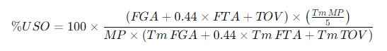

**Es útil para**: Ver la cantidad de posesiones en la que un jugador es el "foco" y detectar qué jugadores tienen más protagonismo en términos de finalización de jugadas ofensivas.

**Ampliación/Aplicación**: [https://x.com/basketmatica/status/1838153083026592179](https://x.com/basketmatica/status/1838153083026592179)

#### **Valoración (VAL)**

**Definición**: Métrica que se utiliza para medir el rendimiento global de los jugadores en la pista de baloncesto, basada en estadísticas acumulativas como puntos, rebotes, asistencias, robos, y tapones.

**Fórmula:**

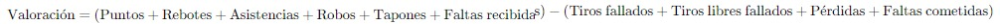

**Es útil para**: Proporcionar una visión rápida y comprensible del rendimiento total de un jugador en un partido, aunque no ajusta para el contexto o la calidad de la competición.

**Ampliación/Aplicación:** [https://x.com/basketmatica/status/1804495718205247706](https://x.com/basketmatica/status/1804495718205247706)

#### **Win Shares (WS)**

**Definición**: Métrica que estima el número de victorias que un jugador aporta a su equipo. Combina el impacto ofensivo y defensivo en un único valor, y el total de WS de todos los jugadores de un equipo se aproxima al total real de victorias del equipo.

**Es útil para**: Evaluar el impacto global de los jugadores más allá de las estadísticas tradicionales, identificar quienes contribuyen al éxito del equipo y orientar las decisiones de los entrenadores en la confección de la plantilla, las rotaciones y el desarrollo de los jugadores.

**Ampliación/Aplicación**: [https://x.com/basketmatica/status/1976006603427254294](https://x.com/basketmatica/status/1976006603427254294)
