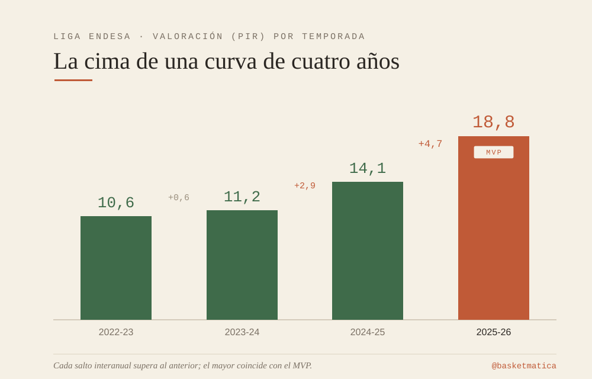
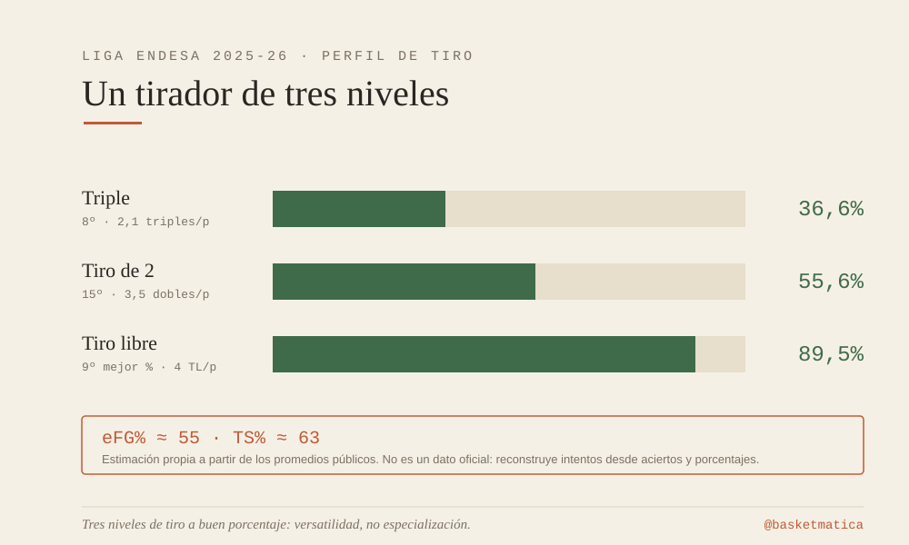
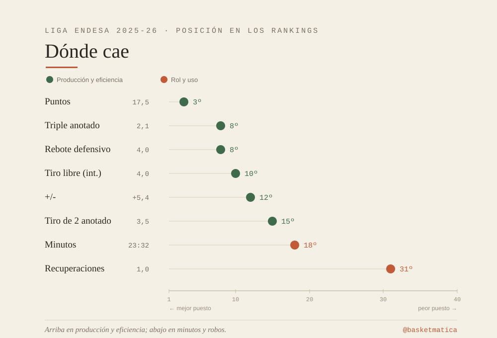
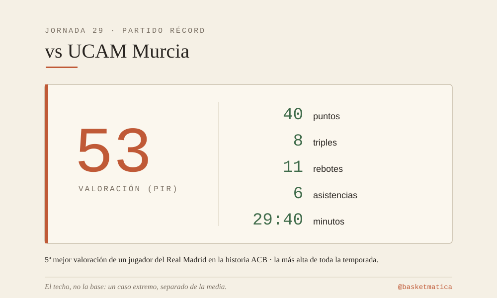

*La valoración de cuatro temporadas explica el premio mejor que cualquier noche aislada.*

Mario Hezonja ha sido elegido MVP de la Liga Endesa 2025-26 con el voto mayoritario de jugadores y medios, y segundo entre entrenadores y afición. Lideró a un Real Madrid que cerró primero la fase regular en puntos, rebotes y valoración, y repite como mejor alero del quinteto ideal. El premio, sin embargo, es el punto de partida de este análisis, no su conclusión. La pregunta no es si lo merece —el reparto de votos es inequívoco—, sino qué tipo de jugador retrata la estadística que lo sostiene. La tesis es sencilla y cuantificable: este MVP no es un estallido puntual, sino la cima visible de una curva de cuatro años.

## La curva, columna vertebral

El dato que mejor ordena su carrera madridista es la valoración por temporada: 10,6 (2022-23), 11,2 (2023-24), 14,1 (2024-25) y 18,8 (2025-26). No es solo un ascenso; es un ascenso que se acelera. Los saltos interanuales —+0,6, +2,9 y +4,7— crecen año a año, y el mayor es precisamente el del curso del premio. Conviene leerlo con precisión: el salto más pronunciado coincide con el MVP, pero descansa sobre tres temporadas de suelo en alza. No es un pico desanclado de su historia, sino el tramo más empinado de una progresión continua. Según acb.com, es además el MVP más valorado de la Liga en los últimos cuatro años. La curva, no los últimos partidos, es el argumento.

## El perfil de tiro como identidad

Su reparto de lanzamientos describe a un anotador completo, no a un especialista. Promedió 2,1 triples por partido con un 36,6% de acierto —octavo de la Liga en triples anotados—, un 55,6% en tiros de dos (3,5 por choque, 15.º) y un 89,5% desde la línea, noveno mejor porcentaje de la competición sobre cuatro intentos por encuentro. La clave no está en ninguno de los tres registros por separado, sino en su coexistencia: volumen de triple a buen porcentaje, eficacia alta en la pintura y un seguro de vida en la línea de personal es un perfil de tres niveles que pocos aleros sostienen a la vez.

A partir de esos promedios públicos puede estimarse —con la cautela de que es un cálculo derivado, no un dato oficial— un eFG% en torno al 55% y un porcentaje de tiro real cercano al 63%, cifras propias de un tirador muy eficiente. Conviene tomarlas como aproximación, pues parten de reconstruir los intentos a partir de aciertos y porcentajes.

## Producción frente a minutos

El volumen bruto engaña si se lee sin contexto. Sus 17,5 puntos lo sitúan tercero de la Liga, por detrás de Luwawu-Cabarrot (18,7) y DeJulius (17,8), y suponen su techo en cuatro cursos. Pero lo relevante es el denominador: los firmó en 23:32 de media, decimoctavo de la competición en minutos y de los más bajos entre los líderes anotadores. Producir como tercer máximo anotador jugando menos que la mayoría de su grupo apunta a un rendimiento por minuto sobresaliente. El contraste entre el tercer puesto en anotación y el decimoctavo en minutos es difícil de explicar sin una alta eficiencia por posesión.

El resto de su huella es sólida y matizable: octavo en rebotes defensivos (4) y vigesimoprimero en totales (4,9), duodécimo en +/- (+5,4) y trigesimoprimero en recuperaciones (1). El +/- positivo conviene tratarlo con prudencia: es una métrica ruidosa y dependiente del equipo, y jugar en el mejor conjunto de la fase regular lo infla por contexto tanto como por mérito individual.

## El techo, como ilustración

La noche frente al UCAM Murcia —40 puntos con 8 triples, 11 rebotes, 6 asistencias y 53 de valoración en 29:40— fue la quinta mejor valoración de un jugador del Real Madrid en la historia de la ACB y la más alta de la temporada. Es casi el triple de su media. Precisamente por extremo, debe leerse como caso aislado y no como evidencia central: un único partido distorsiona cualquier promedio. Más significativa que ese pico es su regularidad en lo alto: fue tres veces Jugador de la Jornada (J14 en el Clásico, J20 y J29 ante Murcia), tantas como una sola vez en sus temporadas anteriores en España. La frecuencia dice más que la cima.

## Lo que el dato no mide

Naturalmente, la estadística disponible deja zonas sin capturar relacionadas con el *tracking* y la gravedad que genera su amenaza exterior. Hay además límites de muestra y de rol: hablamos solo de la fase regular, y 23 minutos por partido son un papel concreto en un equipo profundo y dominante, lo que a la vez infravalora su producción por posesión y le facilita lanzamientos cómodos. Su condición de subcampeón de Euroliga y máximo anotador de la Final Four corrobora el nivel fuera de la Liga, pero pertenece a otra muestra y debe usarse con mesura.

## Cierre

El MVP de Hezonja se entiende mejor mirando la pendiente que el pico. Cuatro años de valoración en ascenso acelerado, un perfil de tiro completo a tres niveles y una producción por minuto que sostiene su tercer puesto anotador con minutos de jugador secundario describen el premio con más fidelidad que cualquier noche de 53 de valoración. La exhibición ante Murcia marca su techo; la curva, de principio a fin, es la que justifica el galardón.
