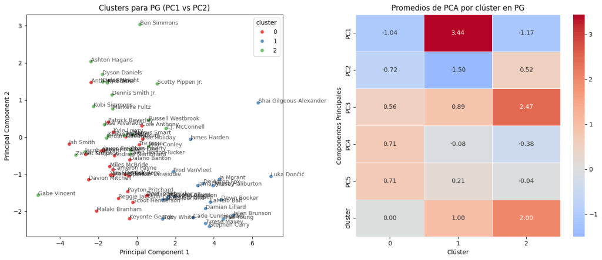
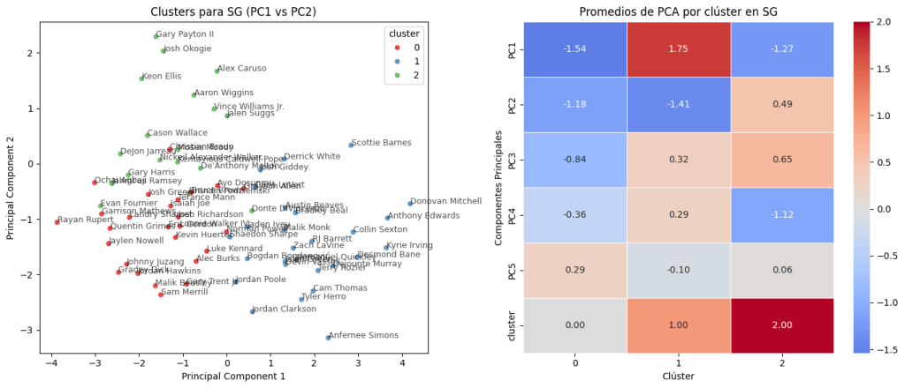
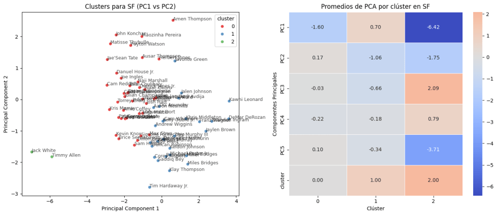
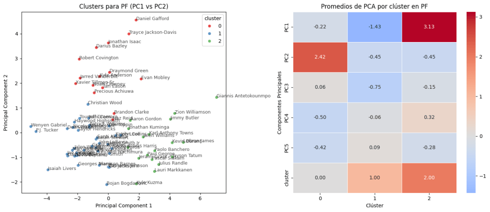
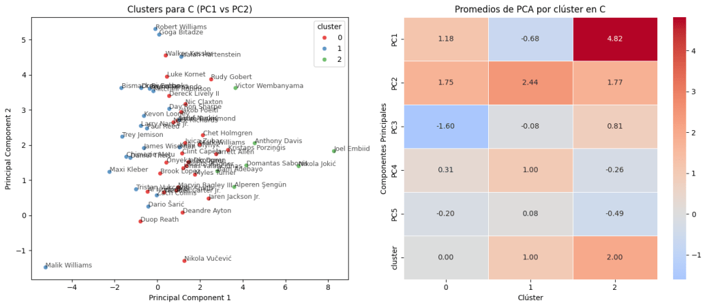

El baloncesto moderno está repleto de jugadores versátiles y completos. Los interiores ya no solo dominan la pintura, sino que deben ser una amenaza desde el triple. Y en casos extremos, como Víctor Wembanyama, el jugador más alto de la NBA, incluso pueden desempeñar funciones de base gracias a su asombrosa coordinación.

Con esta evolución, la línea entre las posiciones tradicionales del baloncesto se vuelve cada vez más difusa. Pero, ¿y si en lugar de posiciones clásicas, definiéramos nuevas categorías basadas en las habilidades reales de los jugadores? Acompáñame en este análisis para descubrir cómo podemos lograrlo.

## 1\. Metodología

Si queremos clasificar jugadores según sus habilidades, necesitamos una forma de agruparlos basada en datos, no en etiquetas predefinidas. Aquí es donde entra en juego el clustering, una técnica de aprendizaje automático que nos permite encontrar grupos dentro de un conjunto de datos sin necesidad de definirlos previamente.

Imagina que tienes una hoja con las estadísticas de cientos de jugadores: puntos, rebotes, asistencias, eficiencia defensiva, etc. Con el clustering, el algoritmo detecta patrones y forma grupos de jugadores con estilos de juego similares, incluso si tradicionalmente jugaran en posiciones distintas. ¿Cómo lo hacemos? Siguiendo estos pasos:

1.  Reducimos la cantidad de datos con PCA: Usamos una técnica llamada Análisis de Componentes Principales (PCA) para simplificar la información, asegurándonos de mantener la mayor parte de la esencia de cada jugador.
2.  Agrupamos jugadores con K-Means: Aplicamos el algoritmo de clustering K-Means, que divide a los jugadores en grupos basados en sus características reales.
3.  Encontramos el número ideal de grupos: No sabemos de antemano cuántos "tipos de jugador" existen, así que usamos el Silhouette Score, una métrica que nos ayuda a determinar cuántos clústeres tienen más sentido.
4.  Visualizamos los resultados: Finalmente, representamos a los jugadores en un gráfico para analizar si los grupos encontrados tienen sentido desde una perspectiva táctica y de juego.

Para que el clustering tenga sentido, es fundamental elegir bien las estadísticas que usamos. En este caso, hemos seleccionado métricas que reflejan distintos aspectos clave del juego, desde la eficiencia anotadora hasta el impacto defensivo. Estas son las que hemos utilizado:

\- **Eficiencia anotadora**: Points Per Game, True Shooting Percentage, Free Throw Rate.

\- **Eficiencia e impacto global**: PER, Offensive Plus-Minus y Defensive Plus-Minus.

\- **Playmaking**: Assist Percentage, Turnover Percentage.

\- **Rebote**: Total Rebound Percentage.

\- **Defensa**: Steal Percentage, Block Percentage.

\- **Uso**: Usage Percentage.

\- **Estilo de tiro**: Three Point Rate.

Para más información sobre los datos, consultar el desplegable de abajo. Además, si se tiene alguna duda sobre las estadísticas a utilizar, todas pueden encontrarse en mi [Glosario de Basketball Analytics](/2024/09/08/glosario-de-basketball-analytics/).

Acerca del conjunto de datos

El conjunto de datos utilizado para este análisis ha sido obtenido de la página web de Kaggle. Puedes acceder a él pinchando&nbsp;<a href="https://www.kaggle.com/datasets/sumitrodatta/nba-aba-baa-stats">aquí</a>. Hay una gran cantidad de archivos con datos desde el 1947. Para este análisis, se utilizarán los siguientes: <em>Advanced.csv</em> y <em>Player Per Game.csv</em>

## 2\. Componentes Principales

Con el objetivo de reducir la dimensionalidad del conjunto de datos y facilitar su interpretación, se ha llevado a cabo un Análisis de Componentes Principales (PCA). Este proceso permite agrupar las distintas estadísticas individuales en un número reducido de componentes que explican la mayor parte de la varianza observada.

En este caso, el PCA ha permitido condensar la información en cinco Componentes Principales, cada uno representando una combinación única de métricas estadísticas. Para facilitar su comprensión, en la siguiente tabla se destacan las tres estadísticas con mayor peso (carga) dentro de cada componente:

<table class="has-fixed-layout"><tbody><tr><td><strong>Componentes Principales</strong></td><td><strong>Estadística #1</strong></td><td><strong>Estadística #2</strong></td><td><strong>Estadística #3</strong></td></tr><tr><td>PC1</td><td>PER</td><td>Points Per Game</td><td>Offensive Box Plus-Minus</td></tr><tr><td>PC2</td><td>Block Percentage</td><td>Defensive Box Plus-Minus</td><td>3 Point Rate</td></tr><tr><td>PC3</td><td>Steal Percentage</td><td>Assist Percentage</td><td>Turnover Percentage</td></tr><tr><td>PC4</td><td>Turnover Percentage</td><td>3 Point Rate</td><td>Steal Percentage</td></tr><tr><td>PC5</td><td>True Shooting Percentage</td><td>Turnover Percentage</td><td>3 Point Rate</td></tr></tbody></table>

A partir de las métricas dominantes en cada componente, se puede inferir una interpretación funcional de los mismos:

-   PC1 – Producción ofensiva global: Dominado por estadísticas como el PER, los puntos por partido y el Offensive Box Plus-Minus, este componente refleja el impacto ofensivo general del jugador.

-   PC2 – Aporte defensivo y perfil interior/exterior: Agrupa métricas como el porcentaje de tapones, el Defensive Box Plus-Minus y el 3 Point Rate. Tiende a diferenciar perfiles defensivos interiores (protección del aro) de exteriores (defensa perimetral).

-   PC3 – Juego de creación y presión: Mezcla métricas de robos, asistencias y pérdidas. Captura el estilo de juego en términos de generación de juego y capacidad para forzar errores o cometerlos.

-   PC4 – Toma de decisiones ofensivas: Se centra en pérdidas y 3 Point Rate, y vuelve a incluir robos. Parece recoger aspectos de la toma de decisiones y agresividad ofensiva desde el perímetro.

-   PC5 – Eficiencia de tiro: Con True Shooting %, 3 Point Rate y pérdidas, este componente resume la eficiencia global del jugador a la hora de finalizar jugadas.

## 3\. Resultados

Antes de mostrar los resultados, es importante aclarar un punto. Aunque el Silhouette Score recomendaba dividir a los jugadores en solo dos grupos para cada posición, tras analizar los resultados opté por utilizar tres. Esta decisión se tomó aceptando un pequeño margen de ruido, pero buscando que la clasificación fuera más significativa y explicativa. Con ello, quiero destacar que los datos son fundamentales, pero no deben tomarse como una verdad absoluta: el contexto y la experiencia en el campo siguen siendo clave para interpretar los resultados correctamente. Por lo tanto, será normal encontrar en los gráficos dos clústeres con jugadores entremezclados o algún jugador no del todo clasificado correctamente.

Para cada posición, se mostrará un gráfico con todos los jugadores clasificados según su clúster, y junto a dicho gráfico un mapa de calor mostrando la relación de cada clúster de jugadores con cada componente principal.

### 3.1. Bases (PG)

A continuación, se muestran los gráficos de clústeres y PCAs de los bases:

-   **Arquitectos del Triple** (Clúster 0). Bases con buena visión de juego y volumen exterior. No son primeras espadas ofensivas, pero aportan organización y espacio. Ejemplos: Cameron Payne, Payton Prichard, Kyle Lowry.
-   **Generadores Ofensivos de Élite** (Clúster 1). Jugadores con una carga ofensiva altísima: anotan, asisten y generan ventajas de forma constante. Ejemplos: Stephen Curry, Luka Doncic, James Harden.
-   **Directores Defensivos** (Clúster 2). Bases con fuerte impacto defensivo, buena organización del juego y menor volumen ofensiva. Ejemplos: Ben Simmons, José Alvarado, Dyson Daniels.

### 3.2. Escoltas (SG)

A continuación, se muestran los gráficos de clústeres y PCAs de los escoltas:

-   **Especialistas en Tiro Exterior** (Clúster 0). Jugadores que viven en el perímetro: volumen y eficiencia en el triple como principal aporte. Ejemplos: Kevin Huerter, Malik Beasley, Luke Kennard.
-   **Anotadores Versátiles** (Clúster 1). Escoltas con gran capacidad de crear su propio tiro, anotar en volumen y asumir protagonismo ofensivo. Ejemplos: Donovan Mitchell, Anthony Edwards, Kyrie Irving.
-   **Escoltas 3&D** (Clúster 2). Perfiles con un gran impacto defensivo y capacidad para anotar desde el triple sin necesidad de balón. Ejemplos: Alex Caruso, Aaron Wiggins, Jalen Suggs.

### 3.3. Aleros (SF)

A continuación, se muestran los gráficos de clústeres y PCAs de los aleros:

-   **Perimetrales Defensivos con Triple** (Clúster 0). Aleros con fuerte perfil defensivo que complementan con amenaza exterior. Ejemplos: Cam Reddish, Matisse Thybulle, Naji Marshall.
-   **Aleros Ofensivos de Alto Impacto** (Clúster 1). Jugadores con capacidad para generar puntos, postear, jugar aclarados y asumir responsabilidad ofensiva. Ejemplos: Jaylen Brown, DeMar DeRozan, Kawhi Leonard.

El tercer clúster fue descartado por su baja representatividad.

### 3.4. Ala-Pívots (PF)

A continuación, se muestran los gráficos de clústeres y PCAs de los ala-pívots:

-   **Especialistas Defensivos** (Clúster 0). Jugadores con gran presencia defensiva y lectura del juego sin necesidad de volumen ofensivo. Ejemplos: Ivan Mobley, Draymond Green, Daniel Gafford.
-   **Stretch 4** (Clúster 1). Ala-pívots con rol espaciador y capacidad para abrir la pista gracias al tiro exterior. Ejemplos: PJ Tucker, Bojan Bogdanovic, Christian Wood.
-   **Referentes Ofensivos Interiores** (Clúster 2). Jugadores capaces de asumir el peso ofensivo del equipo desde posiciones interiores y exteriores. Ejemplos: Giannis Antetokoumpo, Jason Tatum LeBron James.

### 3.5. Pívots (C)

A continuación, se muestran los gráficos de clústeres y PCAs de los pívots:

-   **Interiores Polivalentes** (Clúster 0). Pívots equilibrados, capaces de producir en ataque sin renunicar a proteger la pintura. Ejemplos: Deandre Ayton, Chet Holmgren, Nikola Vucevic.
-   **Protectores del Aro** (Clúster 1). Especialistas defensivos con foco en la intimidación, rebote y contención en la pintura. Ejemplos: Maxi Kleber, Bismack Biyombo, James Wiseman.
-   **Pívots Ofensivos Completos** (Clúster 2). Jugadores que combinan anotación, pase y generación desde el poste con una versatilidad ofensiva diferencial. Ejemplos: Joel Embiid, Nikola Jokic, Victor Wembanyama.

## 4\. Conclusiones

Este análisis nos ha permitido ir más allá de las etiquetas convencionales, revelando perfiles de jugador construidos a partir de su impacto real en pista. Lejos de clasificaciones estáticas, los datos nos muestran un ecosistema mucho más dinámico: hay bases que viven del triple, pívots que organizan el ataque, escoltas que destacan por su defensa y aleros que tiran como escoltas.

Más allá de los nombres propios, la moraleja es clara: el baloncesto moderno no entiende de posiciones fijas, sino de funciones. Entender los roles a partir de datos nos ayuda no solo a analizar mejor, sino a construir equipos más coherentes, encontrar valor oculto y optimizar recursos.

Si quieres ser un experto obteniendo valor de los datos que nos deja el fantástico mundo del baloncesto, suscríbete aquí debajo para no perderte ninguno de mis análisis. ¿Quieres profundizar en el código detrás de este análisis? Está disponible en GitHub. [Haz click aquí para verlo](https://github.com/Basketmatica/basketmatica-clustering). Nos vemos en el siguiente,

Basketmática.
